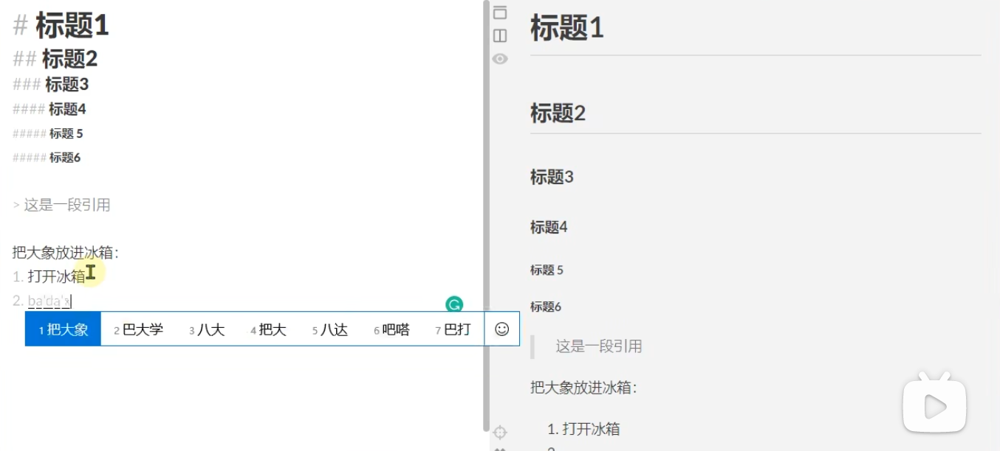

# 0.0本教程浓缩了一下视频
https://www.bilibili.com/video/BV1JA411h7Gw/?spm_id_from=333.337.search-card.all.click&vd_source=8eabb65ad3cfc15b23a05d41f0a4db3c  

# 1.0语法
## 1.1基本语法
### 1.1.1换行
换行需要在每句话后面多打两个或多个空格，然后按一个回车即可创建一个换行  

### 1.1.2各级标题的写法
各级标题其实非常好写，语法结构“## 内容”（注意中间一定要有空格！）   
注意#符号的个数就是几级标题   


### 1.1.3引用的写法
语法：>+引用内容  
显示：竖杠+引用内容  
例如：
>引用内容

### 1.1.4列表
列表分为有序列表和无序列表

#### 1.1.4.1有序列表
语法：题目：  
语法：1.内容1  
语法：2.内容2  
显示：题目：  
显示：1.内容1   
显示：2.内容2  
例如：   
题目：   
1. 内容1   
2. 内容2  

#### 1.1.4.2无序列表
##### 1.1.4.2.1使用短横线的无序列表
语法：题目：  
语法：-内容1  
语法：-内容2  
显示：题目：  
显示：-内容1   
显示：-内容2  
例如：   
题目：   
- 内容1   
- 内容2    

##### 1.1.4.2.2使用星号的无序列表
语法：题目：  
语法：*内容1  
语法：*内容2  
显示：题目：  
显示：*内容1   
显示：*内容2  
例如：   
题目：   
* 内容1   
* 内容2   

##### 1.1.4.2.3任务列表
待勾选：  
语法：题目：  
语法：-[ ]内容1  
语法：-[ ]内容2  
显示：题目：  
显示：[ ]内容1   
显示：[ ]内容2  
例如：   
题目：   
-[ ] 内容1   
-[ ] 内容2

已勾选：  
语法：题目：  
语法：-[x]内容1  
语法：-[x]内容2  
显示：题目：  
显示：√内容1   
显示：√内容2  
例如：   
题目：   
-[x] 内容1   
-[x] 内容2

### 1.1.5高级插入语法

#### 1.1.5.1代码块
语法：利用3个`包裹 利用3个```结束

```python
import numpy  
if ...  
```
#### 1.1.5.2数学公式
语法：利用四个美元符号把公式括起来，注意公式编写使用的是KaTeX语言  
$$  
\sqrt{e^{2} } =e  
$$  
推荐一个在线LaTex公式转换语言网站   
https://www.latexlive.com/##  


## 2.1高级语法
### 2.1.1表格
表格分为表头和内容  
语法：  
表头  
对齐方式    |:-|：在左边居左  |-:|：在右边居左  |:-:|：在两边居中   
内容1  
内容2  

例如：  
|国家|GDP|排名|  
|:--:|:--:|:--:|  
|美国|23.7|1|  
|中国|22.6|2|  
|印度|3.8|3|  

### 2.1.2脚注
脚注分为两部分，一部分是脚注的链接，一部分是脚注的内容  
脚注的链接的写法：   
语法：  
在一段内容后面利用中括号加上冒号   
例如：   
中国的GDP规模也在受到人口老龄化[^规模效应]的制约   
复制中括号加上冒号及其里面的内容，在文章结尾的地方黏贴并自行添加内容就好   

[^规模效应]：当人口达到...    

### 2.1.3横线
横线用来创造一条非常长的分割线，可以帮助将文章划分成多个片区   
语法：---   
例如：   
---
韩国的素质可见一斑，在一份...
---

### 2.1.4链接
#### 2.1.4.1 链接常规写法
语法：[内容](链接)  
例如：  
[百度](www.baidu.com)
#### 2.1.4.2 指向链接写法
通过指向链接可以把很多链接都指向一个链接地址，如果需要更改只需要更改一处就可以
语法：[内容][链接]  
语法：[链接]:www.baidu.com"one search engine"  
例如：  
[百度][id]  
[id]: www.baidu.com "one search engine"  
[百度]  [百度] [百度] 
#### 2.1.4.3 链接指向标题
通过指向链接可以把链接指向标题
语法：[内容](#某个标题)  
例如：  
[标题1](#10语法)


#### 2.1.4.4 URL
语法：https:网站地址 
例如：https://www.bilibili.com/

#### 2.1.4.4 网络图片链接
语法：  
  

### 2.1.5强调
#### 2.1.5.1 斜体
语法：一对星号  
例如：*国家意志*


#### 2.1.5.2 加粗
语法：两对星号  
例如：**国家意志**  

#### 2.1.5.3 行内代码
语法：一对反引号    
例如：``import numpy``  

#### 2.1.5.4 行内数学公式
语法：一对美元符号    
例如： $\sqrt{e^{2} } =e$  

#### 2.1.5.5 下划线
语法：<u>内容</u>    
例如：<u>国家意志</u>     

#### 2.1.5.6 上标
语法：使用一对波浪号      
例如：H~2~O    

#### 2.1.5.7 高亮
语法：使用两对等号      
例如：==无产阶级专政！！！==  

### 2.1.6表情
语法：一对冒号中间加表情    
例如：:smile:  :cry:  
附录：[国际通用表情大全](https://unicode.org/emoji/charts/full-emoji-list.html)

### 2.1.7 嵌入视频
语法：直接copy嵌入代码就好    
例如：用Bilibili举例  
<iframe src="//player.bilibili.com/player.html?aid=327623069&bvid=BV1JA411h7Gw&cid=171385214&page=1" scrolling="no" border="0" frameborder="no" framespacing="0" allowfullscreen="true"> </iframe>
