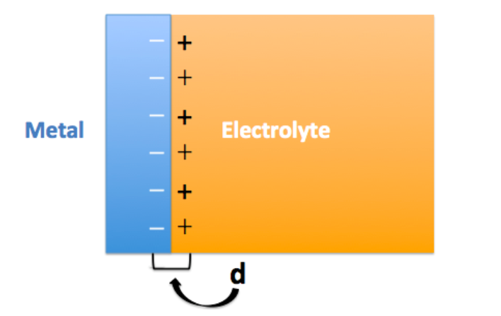
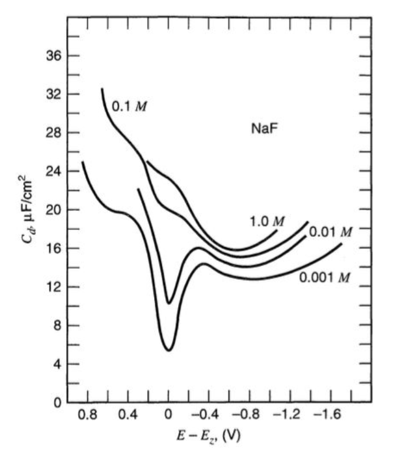
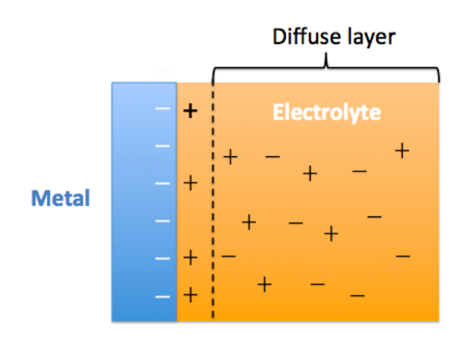
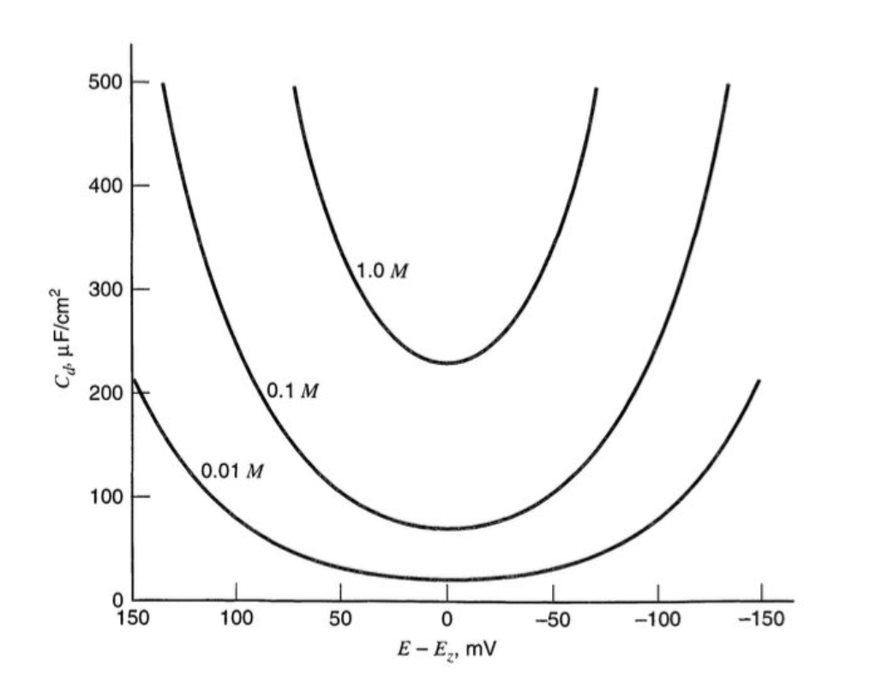
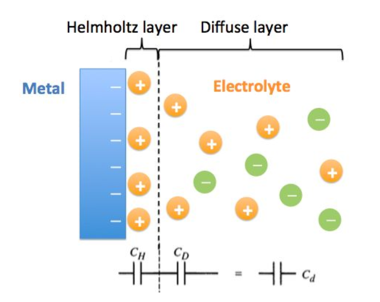
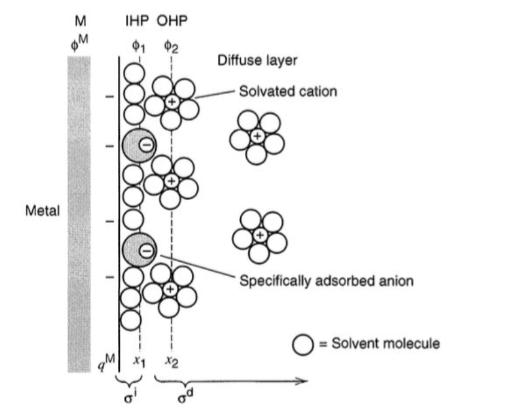

# A Review: Ion Transport of Two-Dimensional Materials in Novel Technologies from Macro to Nanoscopic Perspectives
>为数不多的介绍从宏观到纳米的新技术中二维材料的离子传输现象的文献综述，虽然*Energies*影响因子很低，但是这篇综述的讨论面很详实，在离子运输方面的介绍也非常不错  

[文献原文](https://www.mdpi.com/1996-1073/14/18/5819)  

# 1.介绍
离子传输很重要，这篇综述了电容和离子输运的原理。离子传输的技术的应用等。  
二维材料异军突起，性质特殊。  
该综述描述了各种2D材料中电容和离子传输的基本特性，并从宏观到纳米的角度提供了基于各种潜在技术的新应用。  

# 2.电容性离子（Capacitive Ions）原理  
任何可以带电的系统都会表现出电容行为，在此背景下，可以理解离子吸附和传输，提到一篇文章。  
[**The Capacitance of Graphene: From Model Systems to Large-Scale Devices**](https://onlinelibrary.wiley.com/doi/10.1002/9781119468288.ch2)  
很全面讲述了石墨烯材料电化学研究的不同方面，包括电容理论、电荷存储模型、电容与电解质的关系、二维石墨烯复合材料的形成和三维结构。  

# 3.金属电极电容
[来源](https://zhuanlan.zhihu.com/p/27155545)   
* （1）Helmholtz模型  
首先，亥姆赫兹（Helmholtz）试图探究这个问题，他建立了一个模型，我们简称其为H模型。  
H模型的核心思想是：  
>相反的电荷等量分布于界面两侧。  

   
进而，这个结构可以等效为一个平板电容器，并用如下公式描述单侧的电荷密度（σ）与两层电荷间的电势差（V）的关系，其中，d为正负电荷中心的距离。  
$\sigma=\frac{\varepsilon \varepsilon_{0}}{d} V$
而且，该电容器的电容（$C_{d}$）可表示为：  
$\frac{\partial \sigma}{\partial V}=C_{\mathrm{d}}=\frac{\varepsilon \varepsilon_{0}}{d}$  
这个公式和平板电容器几乎一模一样  

至此，H模型成功地将将一个电化学的普遍场景抽象为两个基本公式。然而，该模型存在一个明显缺陷：由上式可推论出，  
$C_{d}$是一个恒定值，然而实验观测中,$C_{d}$是一个变量，相对电位与电解液浓度等都会对其产生影响。  
比如，汞电极在NaF电解液中，测得$C_{d}$值如下图所示，  
    
其中可以看到明显的两个趋势是:  

（1）$C_{d}$相对于电位成V型的对称分布；

（2）电解液的浓度越高，$C_{d}$数值越大。
因此，一个良好双电层模型需要解释这两个现象。  
* （2）Gouy-Chapman模型    
随后，Gouy和Chapman联手改进了这个模型，我们简称其为G-C模型。

G-C模型的核心是引入了一个新的概念：  
>扩散层（diffuse layer）  

让我们回到电极与电解液的界面处，电荷在电极这一侧是严格分布于其表面。然而，在电解液这一侧却不是这样：由于不同离子间的相互作用，使得很多电荷会扩散到远离界面的体相溶液中。

因此，G-C模型可由下图近似表示，  
  
经过G-C模型的改进，原本电容公式中的d就变成了一个变量。  

不难想象，当界面两侧电势差较大时，更多的离子会被压缩到靠近电极的位置；当电解液浓度高时，离子也可以在较小的空间上与电极达到电荷平衡。  

经过G-C模型的改进，双电层预测NaF的水溶液作为电解液，其电容与电位及浓度关系如下，  
  
可见，经过G-C模型的改进，双电层理论对Cd变化有了很好的解释。  

然而，G-C模型也是由弊端的：  

（1）预测图中，在V型曲线的两端（既电位差极大处），$C_{d}$值趋近于无穷大。而实际测试中，$C_{d}$在该处的值趋向平缓；  

（2）$C_{d}$预测值远远高于实测值。综上，我们可以说G-C模型揭示了“部分真理”，但与现实世界仍有较大偏差。  

* （3）Gouy-Chapman-Stern模型  
G-C模型中，之所以会出现Cd无穷大的预测，是因为电荷被抽象为一个点，这也是物理学中常用的处理方法。  

然而，当我们电势差很大时，这些抽象的“点电荷”会被无限压缩到接近电极表面的位置，因此正负电荷的距离d将趋紧于0，从而造成$C_{d}$接近无穷大。  

据此，Stern在G-C模型的基础上，加入了一个新的条件：  
>离子是有尺寸的  

进而，得到下图所示的G-C-S模型。  
  
G-C-S模型中，Stern将较为紧密的内层成为亥姆赫兹层（Helmholtz layer），该层产生的电容$C_{H}$在固定体系中为恒定值，不受电势差的影响。外层仍为扩散层，产生电容$C_{D}$。    
$C_{H}$与$C_{D}$为串联，共同组成双电层电容$C_{d}$，三者关系为：  $\frac{1}{C_{\mathrm{d}}}=\frac{1}{C_{\mathrm{H}}}+\frac{1}{C_{\mathrm{D}}}$  

由电学知识可知，$C_{d}$永远小于$C_{H}$与$C_{D}$中的较小值。在低电势差时，$C_{D}$值很小，$C_{d}$主要受其影响，而具有V型的特征。在高电势差时，$C_{D}$值很大，而对$C_{d}$值的贡献可以忽略不计，趋近于$C_{H}$值。  

至此，G-C-S模型妥善地解决了上文中涉及的问题。然而，事情并没有结束。  

* （4）后续  

G-C-S模型中仍然有很多未尽之处，比如：  

* * （1）电解液中的阴阳离子表面会被溶剂离子包围，在实际情况中，电荷的载体是这种“溶剂化离子（solvated ions）”；  

* * （2）在界面处会有吸附现象（adsorption）发生，如果吸附力大于静电力，那么即使是同种电荷也可以稳定处于界面处。  

如果考虑这两点，那么，G-C-S模型的改进版将如下图所示，  
  
这就很复杂了，还需要研究   

# 4.金属电容  
2D材料的电容行为分类标准不同，一种方法根据2D材料的电特性来分类例如[半金属、半导体、绝缘体](https://zh.wikipedia.org/wiki/%E5%8D%8A%E9%87%91%E5%B1%9E_(%E8%83%BD%E5%B8%A6%E7%90%86%E8%AE%BA))等。石墨烯是解释半金属电容的合适材料  
# 4.1 石墨烯和碳质材料的电容性
* 半金属性质电容石墨烯  
一般来说，基于双电层（EDL）的碳质材料的电容与上面讨论的stern模型有关，但由于碳基材料上的电荷载流子密度的限制，还需要进一步修改。因此，我们可以在Stern的模型中添加一个额外的项（“空间电荷电容”）：  
$\frac{1}{C_{\text {total }}}=\frac{1}{C_{S C}}+\frac{1}{C_{H}}+\frac{1}{C_{diff}} $  
* 半导体性质电容石墨烯  
如果我们假设固体内电容的电位降表现为半导体，如方程（5）所示，则可以使用半导体模型计算最小空间电荷电容（$Cs{c{(0)}}$）理论。考虑到电位依赖性的影响，也可以使用方程（6）计算空间电荷电容，其中εr是指固相（例如，在石墨a–b平面中$\mathcal{\varepsilon}_{r}$=2.61，沿晶体学c轴$\mathcal{\varepsilon}_{r}$=3.28），$c$是电子电荷载流子密度（~4×1018载流子cm−3） ，且$\varphi_{i}$是电极表面的电位。  
$C_{S C(0)}=\sqrt{\frac{2 \varepsilon_{0} \varepsilon_{r} e^{2} c}{k T}}$   
$C_{S C}=C_{S C(0)} \cosh \left(\frac{\varphi_{i} e}{2 k T}\right)$   
* 低维或纳米材料石墨烯  
不幸的是，这种空间电荷模型无法涵盖所有2D材料，尤其是低维或纳米材料，如石墨烯。这是因为在费米能级或其附近存在有限的态密度（DOS），而石墨烯样品中的电子占据更高的能量状态。在这种情况下，低维材料的电容行为由量子效应描述，当应用低维石墨烯样品（低于4-5层）时会出现量子效应。  

