## 播放照片
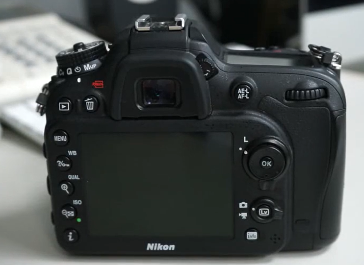
左上角的播放按钮，按一下就能播放
右边的轮盘键，按左右：上一张下一张；按上下：照片更多的相关信息  
照片更多的相关信息的设置在 menu-播放显示选项里面调  
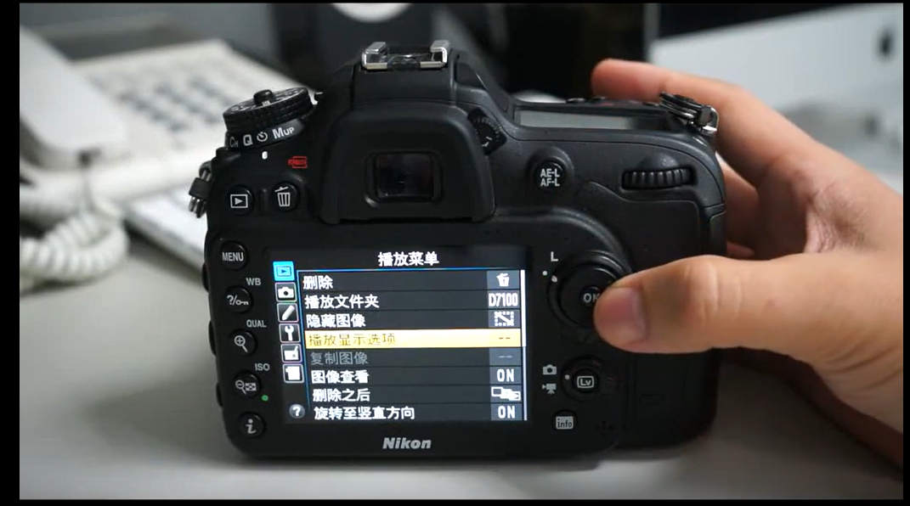  

## 删除照片
单张删除：播放-删除按键  完事！
多张删除：menu-删除  
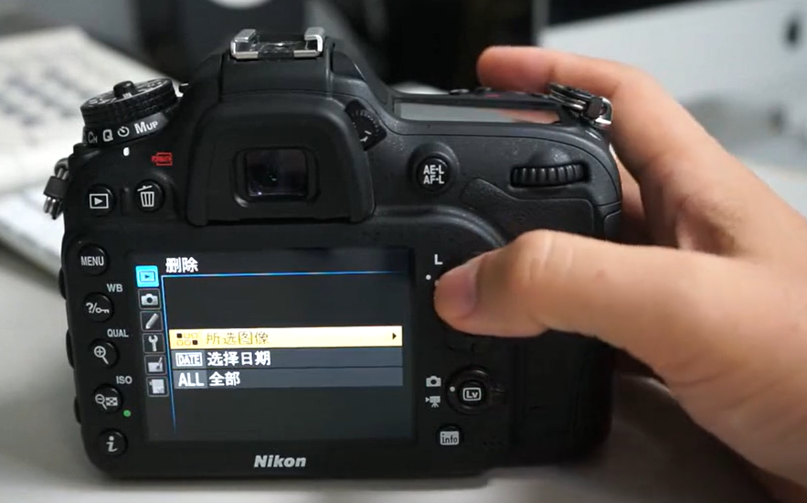

## 存储卡
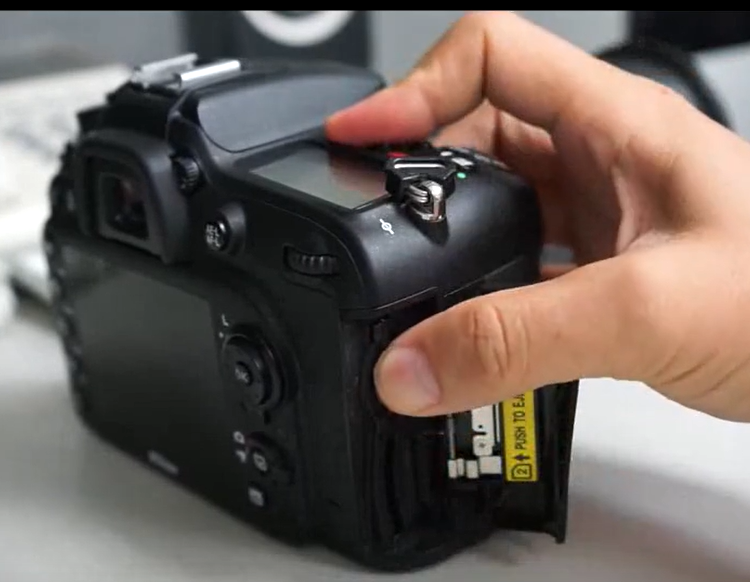
更换存储卡

## 更换镜头
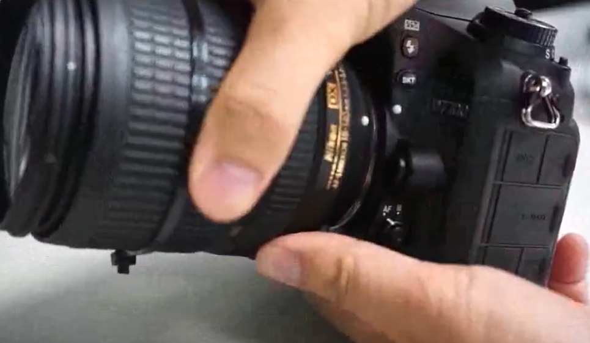
安装：白点相对 旋上即可  
卸载：按下按键 旋下即可  

## 闪光灯
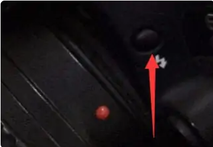
开启：按下这个闪光灯就好了，光板会弹开  
注意：在自动模式下，开闪光灯是自动控制的，你按闪光灯调节按钮没用，只有在M档手动挡的时候有用  

### 调节前转换轮+闪光灯按钮
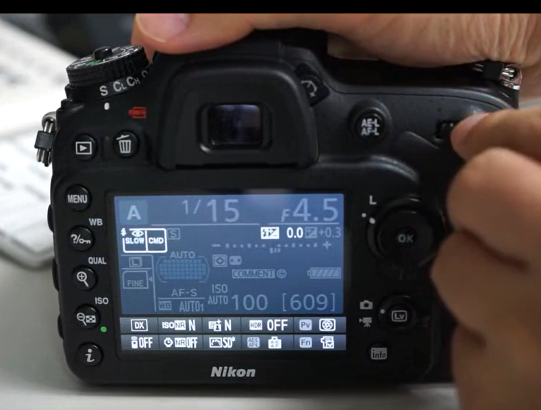

附加知识：  
一般的135单镜头反光相机的快门都有两个快门帘幕，第一快门帘幕和第二快门帘幕。（也称为前帘和后帘）.
基本的动作程序为∶按下快门-->前帘开放-->胶片感光-->后帘关闭。前帘同步和后帘同步的区别是∶  
前帘同步∶第一快门帘幕开放之后的那一瞬间，闪光灯发光。  
后帘同步∶第二快门帘幕关闭之前的一瞬间，闪光灯发光。现在单反相机都是用一种叫做“纵走式”的快门，也就是感光器件前面的快门像窗帘一样，拉开和合上。拉开的时候称作“前帘”，合上的时候叫做“后帘”。闪光灯在快门打开的一瞬间闪亮，就叫做“前帘同步”（SLOW），而在快门即将关闭之前闪亮，就叫做“后帘同步”（SLOW REAR）。  
后帘同步的功能是∶  
可以在慢速快门下，将被摄体最后的影像凝固在图片上，使图片效果带有动感、速度感。   
防红眼是闪光灯 的一种功能，是在正式闪光之前预闪一次，使人眼的瞳孔缩小，从而减轻红眼现象。   

### 调节后转换轮+闪光灯按钮
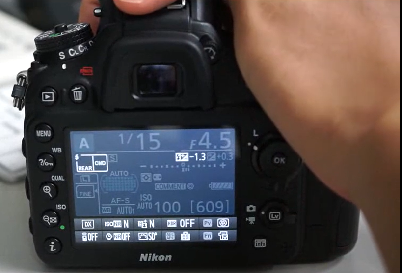
后面的拨盘改变闪光曝光补偿  

## 屈光度调节拨轮  
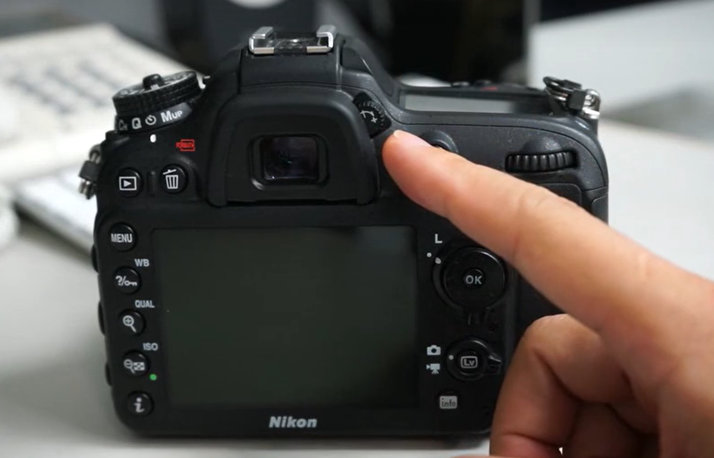
类似于近视眼镜，取景器里面模糊调一下就好  

## 快门释放模式  
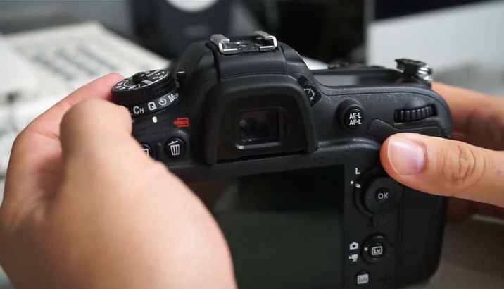
Q：静音  
CH：高速连拍  
CL：低速连拍  
S：单张拍摄  
秒表：自拍模式  

## 多重选择器
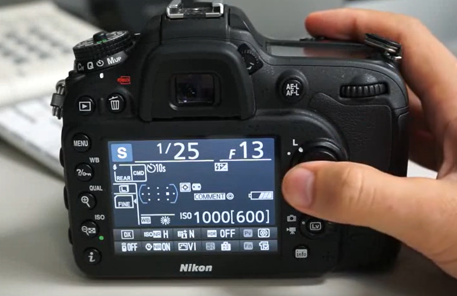
L锁定多重选择器  

## 模式拨盘
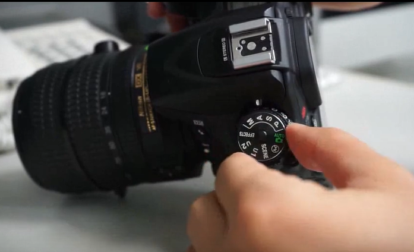
如图调到了A档  
* A （光圈优先，最常用）：光圈优先. 控制光圈大小，控制曝光补偿，快门速度相机自己给出，适用于绝大多数场景；而且控制光圈可以控制景深。. 比如拍摄人的时候，就要大光圈。. 比如拍摄风景的时候，光圈就要小点。. 对于不是着重表现动态的画面，我也建议用光圈优先，基本上也不用来回来去调节什么。. 这个场景就是这样的一个曝光，那么曝光补偿就不用调节了；这个场景就是需要这么一个光圈，那么光圈也不用调来调去。. 也是可以一直拍拍拍的。. 还是M档时说的例子。. 当我使用光圈优先时，光圈我们设定为F5.6，感光度设定为ISO 100，同时我们是可以设定曝光补偿的--对的，我们可以直接决定这张照片的亮度。F大 光圈小 适合 大场景
* S （快门优先曝光模式）选择S你可以控制快门速度，光圈随着暴光量大小来变化。一般拍体育快门速度要快、拍流动的水快门速度要慢以便拍出动感。几分之一就是几分之一秒 
* P （程序曝光模式）类似自动档，快门、光圈由相机设置，不过可以自己调节。选择P，在自动测光完成后，会纪录曝光量，在这个曝光量不变的情况下你可以去调节其中的快门和光圈的组合 。
* M （全手动曝光模式）选择M可由摄影者自己调节拍摄的全部参数（光圈、快门、感光度）来进行拍摄。 

## 曝光补偿
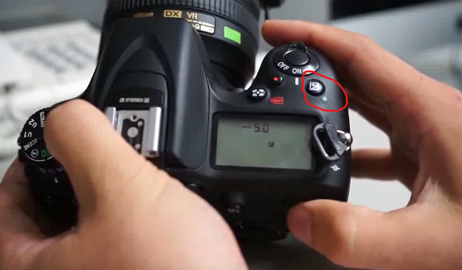
+:更亮 -：更暗  

改变了三大参数都会改变

## 测光模式 
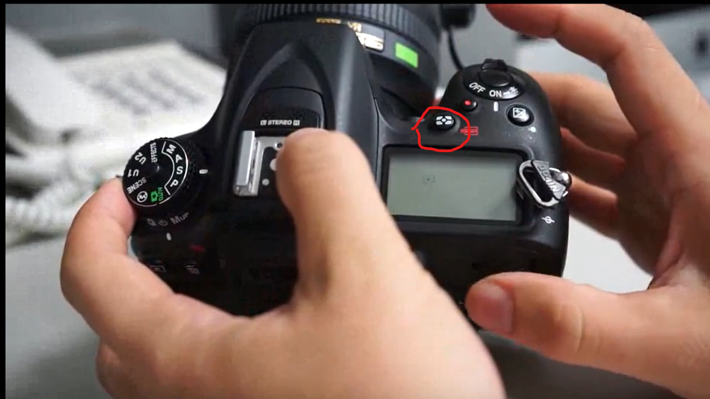
转动拨盘就能测，具体啥原理我也不会  
https://zhuanlan.zhihu.com/p/55162319

## i按钮
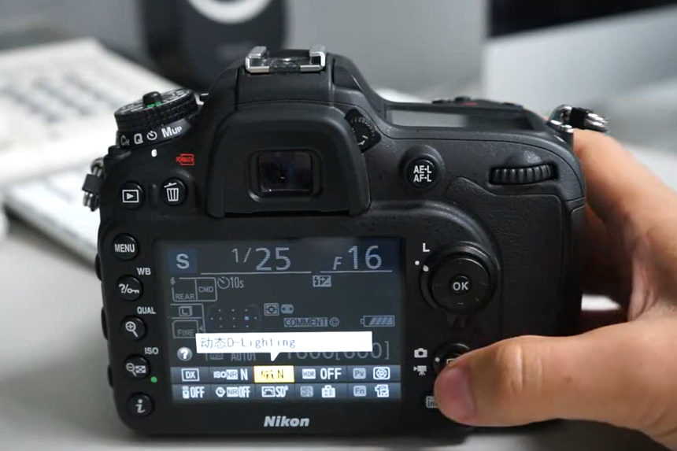
i按钮是激活菜单栏下面两行的参数  

## info按钮

背屏显示所有参数信息  

