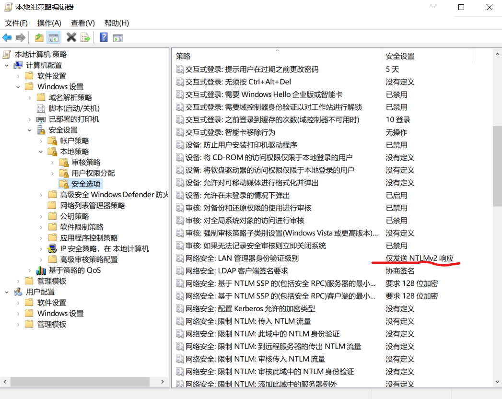
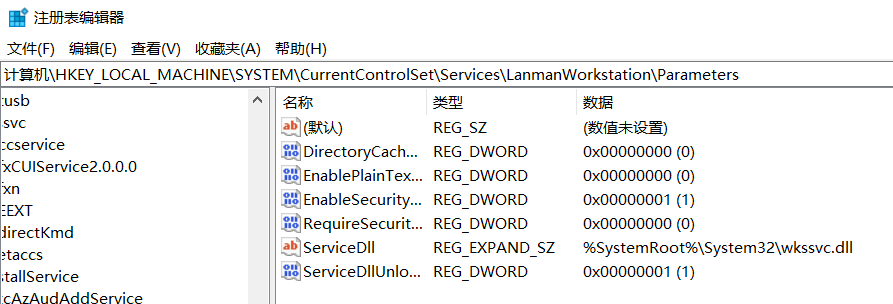
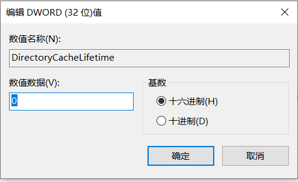

# 1.0 网络速度不尽人意，怎么办？
## 1.1 可能的解决方案1
``win+r``打开运行输入``gpedit.msc``，按照下图配置  
按照左边逐步找到``网络安全：LAN管理器身份验证级别``调整为``仅发送NTLMv2响应``  

## 1.2 可能的解决方案2
[参考](https://techmedixinc.com/how-to-fix-slow-access-to-network-drive-in-windows-10/)  
``win+r``打开运行输入``regedit``，按照下图配置  
  
修改``DirectoryCacheLifetime``为0  
  
