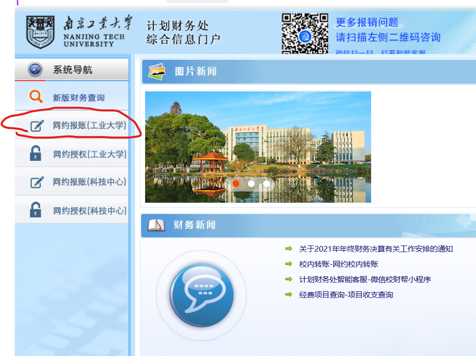
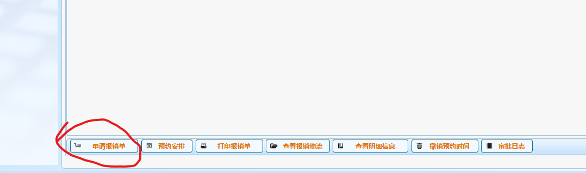
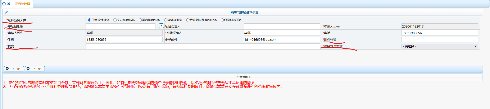
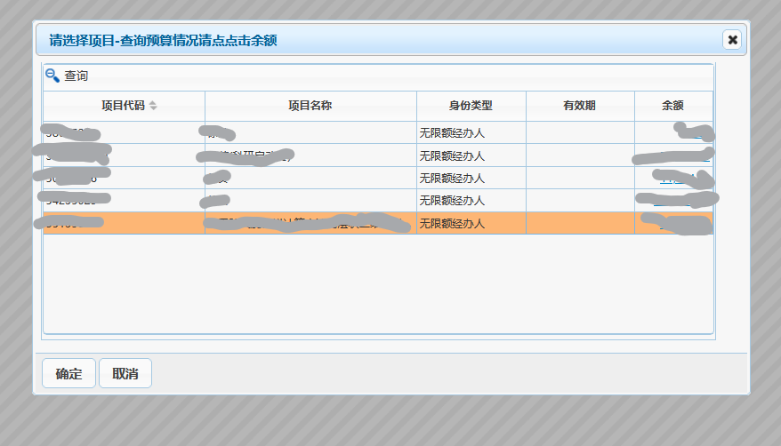
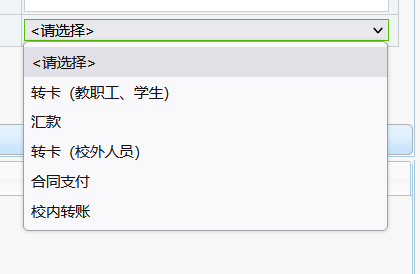
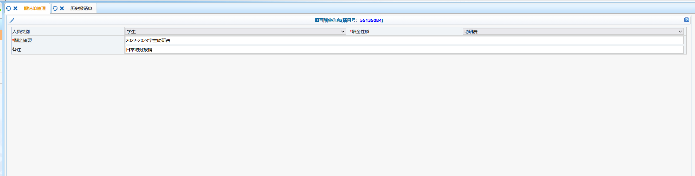
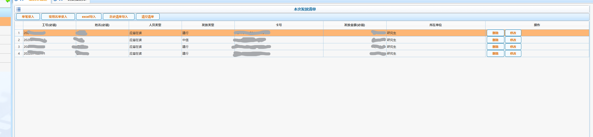
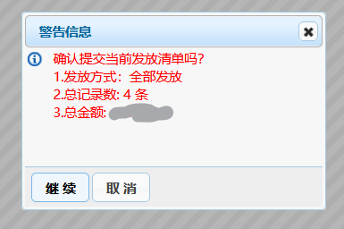
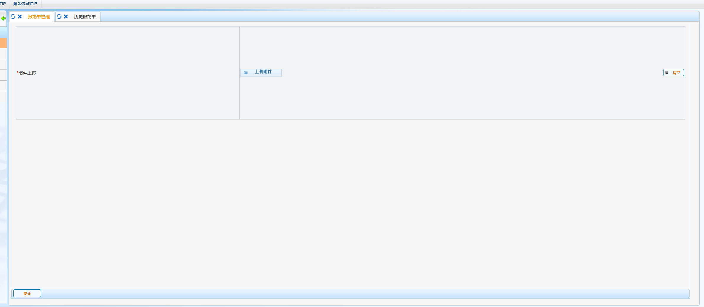
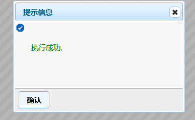

# 1.0 报账的账号以及重要信息  

报账的网站  
https://gjcwpt.njtech.edu.cn/WFManager/login.jsp  

**报账的账号密码是登录该网站完成报账的关键，保存好勿要遗失**  
**先申请报销单，把各种报销单写好**  
**再一把预约，一把打印，这样不容易弄乱**  
**电子发票都要找老师签字，发票和报销单以及其它购买消费证明分类用别针捆好，准备投递**  
**投递地址，综合楼一楼拿塑料袋输入条形码，开箱子塞进去就行，有的时候机器你塞进去了并不能识别到，没关系，塞进去了就ok**  

# 2.0 主要流程及其注意事项  

## 2.1  进入  
单击进入  
  

## 2.2 申请报销单  
在左下角找到  
  
申请即可  

## 2.3 填写报销单管理表  
  
主要要操心去填的是标红的地方  
**选择业务大类、单项目报销、支付方式、摘要、附件张数**  

### 2.3.1 选择业务大类  
一般都是``日常报销业务``，不用动也不用管  
但是涉及到出差开会等要选择``国内旅费业务``  
涉及到报销助研费需要``劳务酬金及奖助业务``  

### 2.3.2 单项目报销  
这个是确定从老师的哪个基金项目里拿钱来报销，**这个很重要,一定要提前问用哪个项目**  
  

### 2.3.3 支付方式  
这个具体是对公，还是转卡给个人（一般都是老师自己），还要看情况，这个老师一般都会说明  
  

### 2.3.4 摘要  
摘要就是填个大概基本上就是填上``日常财务报销``就可以了  
助研费要写哪一年度的助研费``2022-2023学生助研费``就可以了  

### 2.3.5 附件张数最简单  
一般填``3``就行了  

# 3.0 常规报销正文部分

## 3.1 报销助研费  
按照这样写就可以了  
  

注意金额和卡号对不对就可以了，一般都没什么问题
* 但是不要一次全发了，要一个人一个人来报  
  
* 否则会这样
  

继续  
  

到这一步 
  
提交，就ok了  
  

