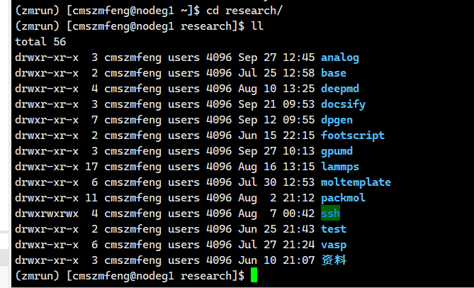
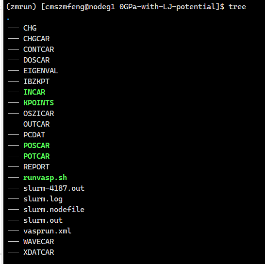
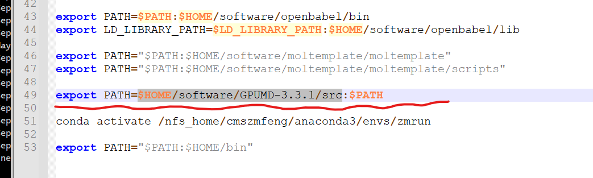
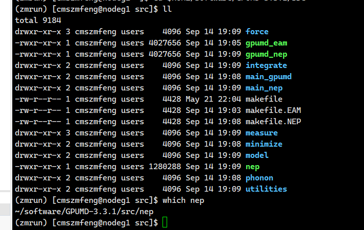
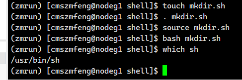

# intro
由于我们服务器系统是``centOS``,``centOS``又是隶属于``Linux``系统，而我们课题组进行计算，分析很多都是基于``Linux``所以对``Linux``的基本学习必不可少。

* 速成的：
https://www.bilibili.com/video/BV1Eq4y1z7u8/?spm_id_from=333.337.search-card.all.click&vd_source=8eabb65ad3cfc15b23a05d41f0a4db3c 

* 持久战的：
https://www.bilibili.com/video/BV1WY4y1H7d3/?spm_id_from=333.337.search-card.all.click  

## 怎么去学？
建议先看速成的，找找感觉。反正也很短加上上手一天搞定。。  
等时间充裕了，可以看持久篇，这里面内容我建议从P66开始看直接看``shell``语法就好了  
实际上，学习存在**学了不用就忘**这种情况，所以我建议如果着手于组内工作的开展，那是边学边用其实绝大部分事务绝对绝对够，因为实际上操作的**命令**不多，这里可以列出一些简单的：  
* 进入某个文件夹用``cd xxx``,退出就用``cd ..``，单独一个``cd ``就是退出到根目录，一个小技巧，有的文件夹名字太长实际上可以用``tab``按键进行**补全**，有的时候文件夹前置同名有点多，补全操作不可能一次到位就要慢慢补全。

* 查看文件目录：用命令``ll``  
Ex:  
  
* 有的文件夹比较小，但是想预览全部文件就可以用``tree``命令进行树状展开  
  

* 增
* * 新建文件``touch xxx``新建xxx的文件  
* * 新建文件夹``mkdir xxx``新建xxx的文件夹   
* 删
* * 删除文件``rm xxx``删除xxx的文件  
* * 删除文件夹``rm -rf xxx``删除文件夹及其下属所有子文件。  
* 改
* * 修改文件/文件夹名``mv xxx yyy``xxx文件名改为yyy  

* 运行  
执行任何文件都要确保是命令体系内的，包括上面的命令行语句其实已经是一种执行，  
一般的shell语句和linux系统文件操作都不需要重新定义查找等直接拿来就可以用  、
但是很多程序需要将执行目录的文件夹放在根目录的``.bashrc``文件中  
* *运行程序
* * * 构建程序的运行路径到根目录  
 

* * * 使用shell脚本
shell脚本的学习方法不赘述，在这里要运行的话有很多种方法，经典的就是  
``sh````bash````.````source`` 后面加上   ``xxx.sh``  ``xxx.bash``  
就可以运行  
Ex：对于一份增加文件夹的脚本  
执行哪一条都可以  
  
* * * **使用slurm调度**   
为啥？主要是因为我们服务器很多，管理服务器是使用一个叫``slurm``  的服务器调度系统。  
这边不细讲，我会单独写一章，这里不细讲。  
主要就是同一个程序可以通过这个调度系统在另一个机子上跑。。  
Ex：  
```shell
#!/bin/bash
#SBATCH -J liquid100(CPU:6*16)
#SBATCH -N 1
#SBATCH -n 56
#SBATCH -t 240:00:00
#SBATCH --cpus-per-task=1
#SBATCH -w node04


cd $SLURM_SUBMIT_DIR
srun hostname | sort > slurm.nodefile

# --------------- Do NOT Change the code in the box --------------- #
echo "# ----------------- Job log ----------------- #" >> slurm.log #
echo ""                                                >> slurm.log #
echo "Job dir    is: `pwd`"                            >> slurm.log #
echo "Job starts at: `date`"                           >> slurm.log #
echo "Job works  at: `srun hostname | sort| uniq`"     >> slurm.log #
# ----------------------------------------------------------------- #

source /home/public/software_install/intel/bin/compilervars.sh intel64

(time mpirun -hostfile slurm.nodefile -np $SLURM_NTASKS vasp_std.6.1.0 > slurm.out) 2>>slurm.log

# --------------- Do NOT Change the code in the box --------------- #
echo ""                                                >> slurm.log #
echo "Job finishes at: `date`"                         >> slurm.log #
echo ""                                                >> slurm.log #
# ----------------------------------------------------------------- #

``` 

