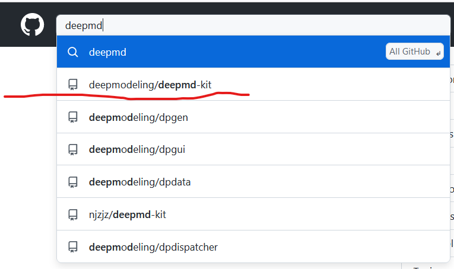
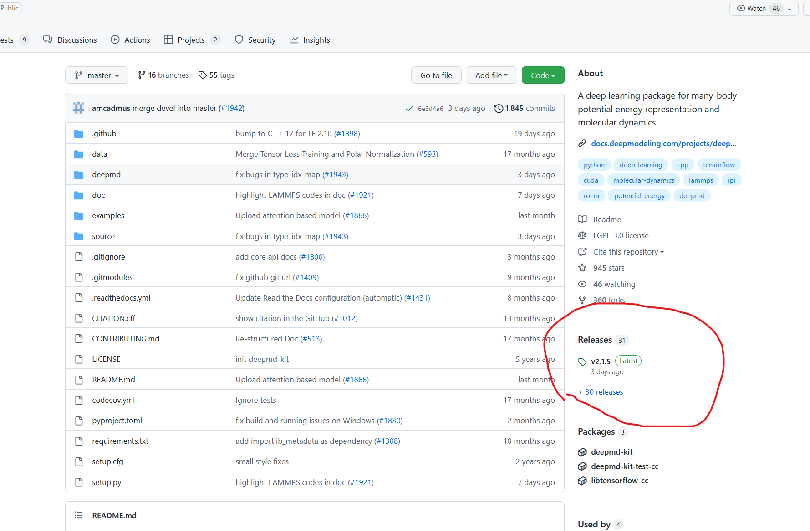
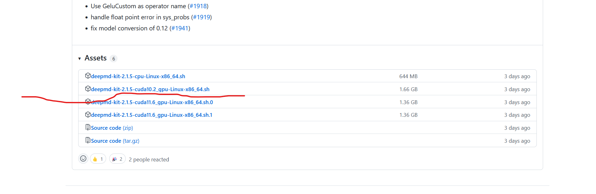
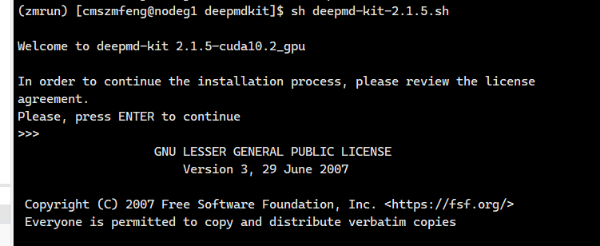
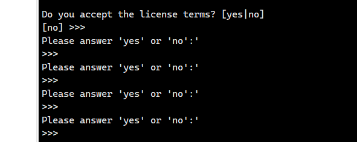
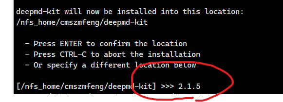

# intro

## 安装方法
deepmdkit安装方法非常简单  
首先在Github上面下载最新的sh驱动即可  
1.搜索这个作者deepmodeling的deepmd-kit  

2.点击release进入  

3.往下翻，找到你想要的版本  
建议用gpu版本，无它，gpu快  
另外自己家的cuda版本一定要大于安装的cuda版本  

4.把安装的sh程序放到自己想安装的文件夹目录下，比如我因为考虑到deepmd版本比较多，所以我自己建了一个文件夹就叫deepmdkit专门储存各种版本的deepmd
5.安装执行一条命令就可以了，sh deepmd....sh 

然后疯狂enter以阅读完协议  

输入yes  
输入你想安装的文件夹的名字，我建议输入成版本号，而且我建议一定要输入，如果你不输入的话会导致它在根目录开始安装这就非诚坑占据你宝贵的根目录整洁度  

然后等待就完事了 

### 删除
这个环境的安装很有意思  
用```conda env list```命令可以发现其实它没有名字只有地址  
完全彻底删除的命令  
```conda uninstall -n env_name --all```  
```conda env remove -n env_name```  
```conda env remove -p env_path```  都不管用  
算了，直接``rm -rf``完事 哈哈哈   
## 简单运行
