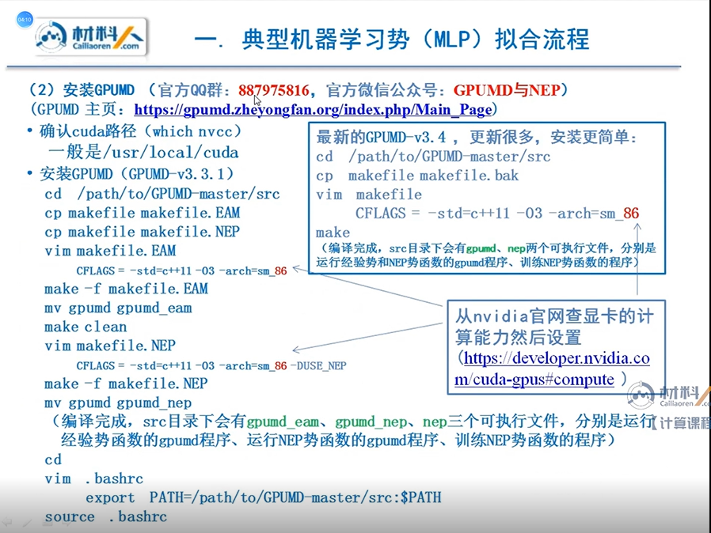
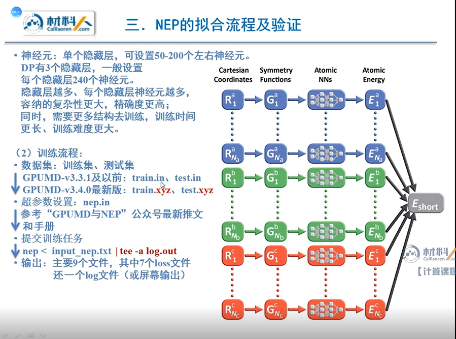
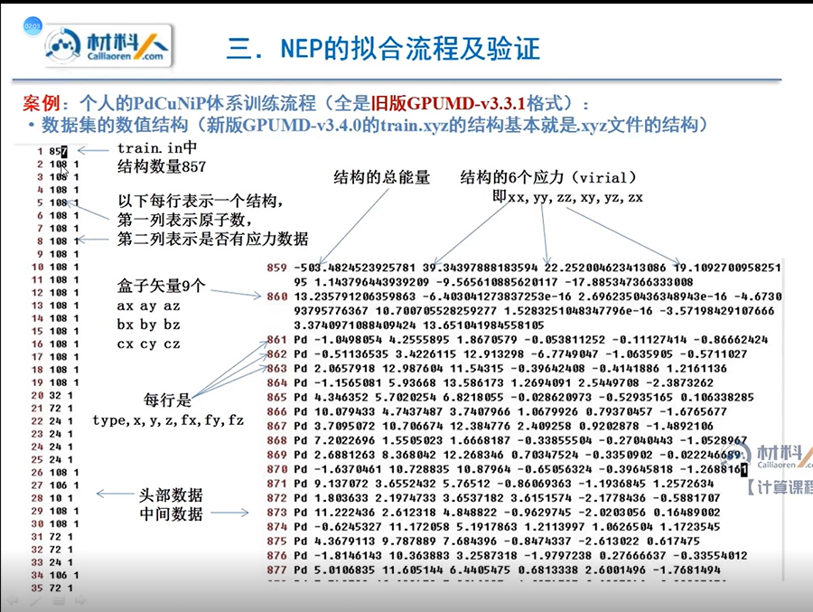
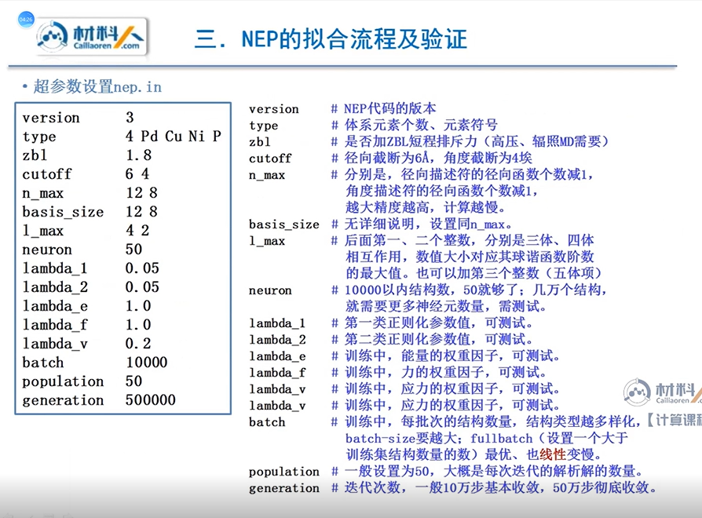
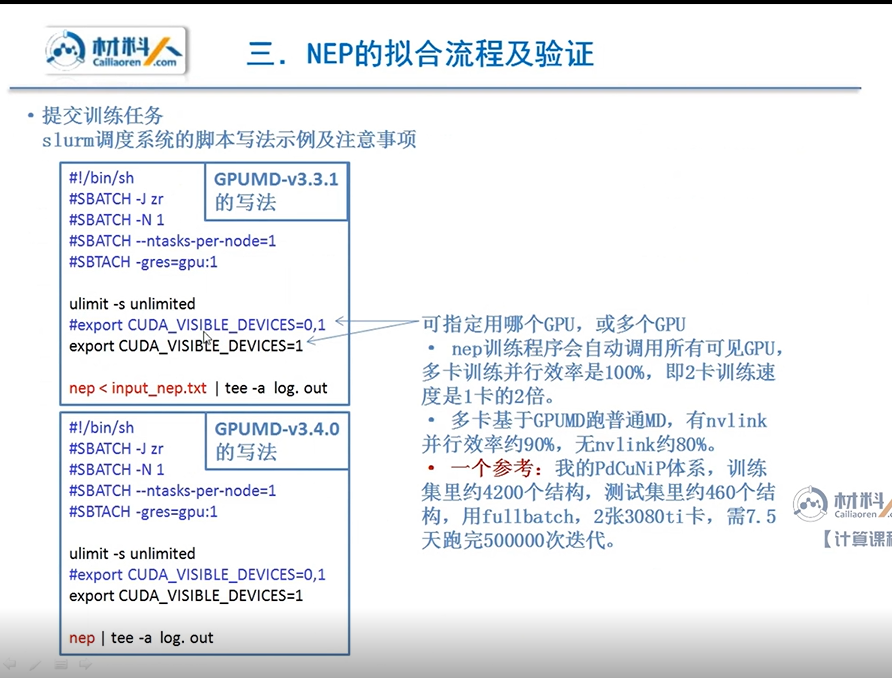
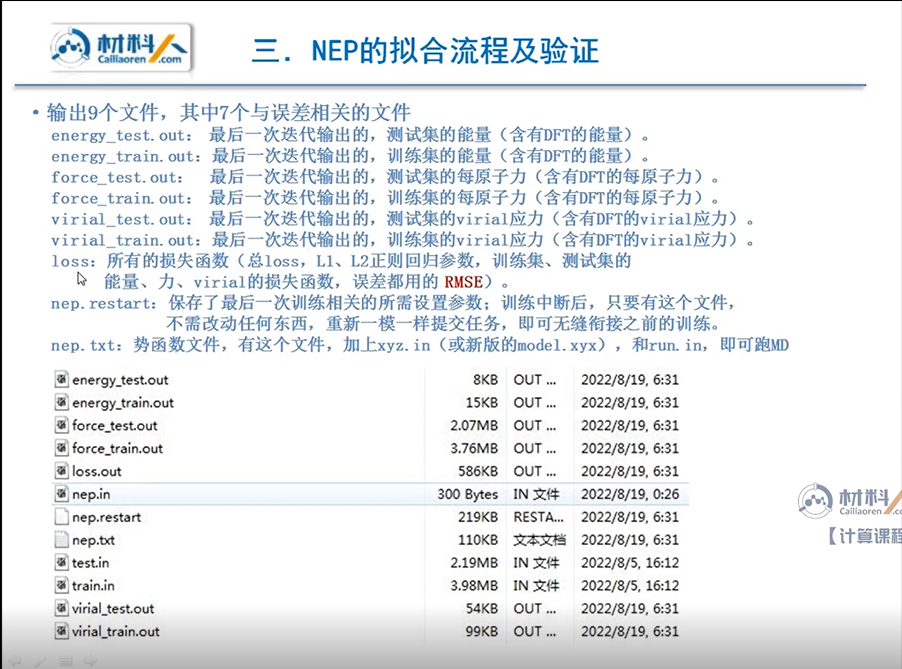
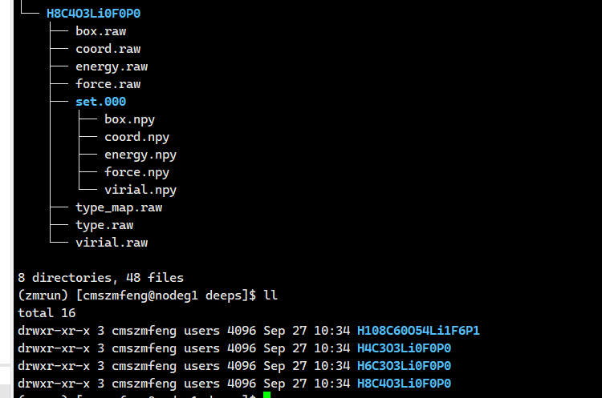
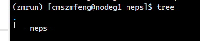

## intro
目前最新的版本是3.4.0，最稳定的版本是3.3.1  
而3.4.0相较于3.3.1经历了一番大改，各种功能经过了简化，输入输出文件格式也发生了变化，但是由于刚刚更新完成，暂时还有一些bug，本案例我们还是以3.3.1开始探讨  

## 两款安装方法
  

## 运行方法，输入和输出


### train数据集结构
3.4.0用的是train.in
3.3.1用的是train.xyz
本例我们采用train.in来说明


### 超参数设置nep.in


### slurm调度系统脚本写法


### 输出文件


## 简单去run
首先获得vasp算完的结果  
这是大致方法：  
  

首先用``outcar2deep.py``这个脚本get一个文件夹及其下辖子文件夹 所有的OUTCAR，我贴一下防止遗失  
使用方法``python outcar2deep.py inputdirs outputdirs``
```python
# run mode:  python  outcar2deep.py  input_name  output_name(e.g., 2_deep_train)

import os
import sys
import dpdata
from dpdata import LabeledSystem,MultiSystems
from glob import glob

input_name  = sys.argv[1]
output_name = sys.argv[2]

ms = MultiSystems()
fwalk = os.walk(input_name)

all_outcar = []
for root,dirs,files in fwalk:
    if "OUTCAR" in files:
        all_outcar.append(os.path.join(root,"OUTCAR"))

print(all_outcar) 

for i in all_outcar:
    try:
        ls=LabeledSystem(i)
    except:
        print(i)
    if len(ls)>0:
        ms.append(ls)

#outname = "dpraw_" + sys.argv[1].replace("/","_").replace(".","")
ms.to_deepmd_raw(output_name)
ms.to_deepmd_npy(output_name)

```
例如我这边新建了一个``outcars``文件夹放一些vasp计算出来的outcar

输入命令得到deeps，下图为其预览    


现在我们得到了一个提纯后初始计算信息量，但是这种结构并不能被``GPUMD``识别并进行运算，还需要一个脚本，``deep2nep.py``可以帮助做到，我也贴一下代码防止遗失  
```python
"""
    Purpose:
        Convert deepmd input file format to train.in of nep.
        The structure of the input directory is as follows:
          Type:1 (has virial)
            deepmd/init.000/
            ├── set.000
            │   ├── box.npy
            │   ├── coord.npy
            │   ├── energy.npy
            │   ├── force.npy
            │   └── virial.npy
            ├── type.raw
            └── type_map.raw
          Type:2 (no virial)
            deepmd/init.001/
            ├── set.000
            │   ├── box.npy
            │   ├── coord.npy
            │   ├── energy.npy
            │   └── force.npy
            ├── type.raw
            └── type_map.raw
    An example:
        https://github.com/Kick-H/nep_deepmd_mutual_conversion
    Ref:
        dpdata: https://github.com/deepmodeling/dpdata
    Run:
        python nep2xyz.py input_name output_name 
    Author:
        Ke Xu <twtdq(at)qq.com>
"""

import os
import sys
import glob
import numpy as np

input_name  = sys.argv[1]
output_name = sys.argv[2]

ELEMENTS=['H', 'He', 'Li', 'Be', 'B', 'C', 'N', 'O', 'F', 'Ne', 'Na', 'Mg', 'Al', 'Si', 'P', 'S', 'Cl', 'Ar', 'K', 'Ca', 'Sc', 'Ti', 'V', 'Cr', \
         'Mn', 'Fe', 'Co', 'Ni', 'Cu', 'Zn', 'Ga', 'Ge', 'As', 'Se', 'Br', 'Kr', 'Rb', 'Sr', 'Y', 'Zr', 'Nb', 'Mo', 'Tc', 'Ru', 'Rh', 'Pd', 'Ag',\
         'Cd', 'In', 'Sn', 'Sb', 'Te', 'I', 'Xe', 'Cs', 'Ba', 'La', 'Ce', 'Pr', 'Nd', 'Pm', 'Sm', 'Eu', 'Gd', 'Tb', 'Dy', 'Ho', 'Er', 'Tm', 'Yb',\
         'Lu', 'Hf', 'Ta', 'W', 'Re', 'Os', 'Ir', 'Pt', 'Au', 'Hg', 'Tl', 'Pb', 'Bi', 'Po', 'At', 'Rn', 'Fr', 'Ra', 'Ac', 'Th', 'Pa', 'U', 'Np', \
         'Pu', 'Am', 'Cm', 'Bk', 'Cf', 'Es', 'Fm', 'Md', 'No', 'Lr']

def convervirial(invirial):

    vxx = invirial[0,0]
    vxy = invirial[0,1]
    vzx = invirial[0,2]
    vyy = invirial[1,1]
    vyz = invirial[1,2]
    vzz = invirial[2,2]

    return [vxx, vyy, vzz, vxy, vyz, vzx]

def vec2volume(cells):
    va = cells[:3]
    vb = cells[3:6]
    vc = cells[6:]
    return np.dot(va, np.cross(vb,vc))

def cond_load_data(fname) :
    tmp = None
    if os.path.isfile(fname) :
        tmp = np.load(fname)
    return tmp

def load_type(folder, type_map=None) :
    data = {}
    data['atom_types'] \
        = np.loadtxt(os.path.join(folder, 'type.raw'), ndmin=1).astype(int)
    ntypes = np.max(data['atom_types']) + 1
    data['atom_numbs'] = []
    for ii in range (ntypes) :
        data['atom_numbs'].append(np.count_nonzero(data['atom_types'] == ii))
    data['atom_names'] = []
    # if find type_map.raw, use it
    if os.path.isfile(os.path.join(folder, 'type_map.raw')) :
        with open(os.path.join(folder, 'type_map.raw')) as fp:
            my_type_map = fp.read().split()
    # else try to use arg type_map
    elif type_map is not None:
        my_type_map = type_map
    # in the last case, make artificial atom names
    else:
        my_type_map = []
        for ii in range(ntypes) :
            my_type_map.append('Type_%d' % ii)
    assert(len(my_type_map) >= len(data['atom_numbs']))
    for ii in range(len(data['atom_numbs'])) :
        data['atom_names'].append(my_type_map[ii])

    return data

def load_set(folder) :
    cells = np.load(os.path.join(folder, 'box.npy'))
    coords = np.load(os.path.join(folder, 'coord.npy'))
    eners  = cond_load_data(os.path.join(folder, 'energy.npy'))
    forces = cond_load_data(os.path.join(folder, 'force.npy'))
    virs   = cond_load_data(os.path.join(folder, 'virial.npy'))
    return cells, coords, eners, forces, virs

def to_system_data(folder):
    # data is empty
    data = load_type(folder)
    data['orig'] = np.zeros([3])
    data['docname'] = folder
    sets = sorted(glob.glob(os.path.join(folder, 'set.*')))
    all_cells = []
    all_coords = []
    all_eners = []
    all_forces = []
    all_virs = []
    for ii in sets:
        cells, coords, eners, forces, virs = load_set(ii)
        nframes = np.reshape(cells, [-1,3,3]).shape[0]
        all_cells.append(np.reshape(cells, [nframes,3,3]))
        all_coords.append(np.reshape(coords, [nframes,-1,3]))
        if eners is not None:
            eners = np.reshape(eners, [nframes])
        if eners is not None and eners.size > 0:
            all_eners.append(np.reshape(eners, [nframes]))
        if forces is not None and forces.size > 0:
            all_forces.append(np.reshape(forces, [nframes,-1,3]))
        if virs is not None and virs.size > 0:
            all_virs.append(np.reshape(virs, [nframes,3,3]))
    data['frames'] = nframes
    data['cells'] = np.concatenate(all_cells, axis = 0)
    data['coords'] = np.concatenate(all_coords, axis = 0)
    if len(all_eners) > 0 :
        data['energies'] = np.concatenate(all_eners, axis = 0)
    if len(all_forces) > 0 :
        data['forces'] = np.concatenate(all_forces, axis = 0)
    if len(all_virs) > 0:
        data['virials'] = np.concatenate(all_virs, axis = 0)
    if os.path.isfile(os.path.join(folder, "nopbc")):
        data['nopbc'] = True
    return data

def read_multi_deepmd(folder):

    data_multi = {}
    for i, fi in enumerate(os.listdir(folder)):
        if os.path.isdir(os.path.join(folder, fi)):
            ifold = os.path.join(folder, fi)
            idata = to_system_data(ifold)
            if 'virials' in idata and len(idata['virials']) == idata['frames']:
                idata['has_virial'] = np.ones((idata['frames']), dtype=bool)
                #print(idata['frames'],len(idata['virials']), idata['has_virial'])
            else:
                idata['has_virial'] = np.zeros((idata['frames']), dtype=bool)
                #print(idata['frames'],idata['has_virial'])
            data_multi[i] = idata

    nframes = np.sum([data_multi[i]['frames'] for i in data_multi])

    data = {}
    data['nframe'] = nframes
    data['docname'] = ['' for i in range(nframes)]
    data['atom_numbs'] = np.zeros((data['nframe']))
    data['has_virial'] = np.zeros((data['nframe']))
    data['energies'] = np.zeros((data['nframe']))
    data['virials'] = np.zeros((data['nframe'], 6))
    data['cells'] = np.zeros((data['nframe'], 9))
    data['volume'] = np.zeros((data['nframe']))
    data['atom_names'] = {}
    data['atom_types'] = {}
    data['coords'] = {}
    data['forces'] = {}


    ifr = -1
    for i in data_multi:

        atom_names = [data_multi[i]['atom_names'][j] for j in data_multi[i]['atom_types']]

        for j in range(data_multi[i]['frames']):

            ifr += 1
            data['atom_numbs'][ifr] = len(data_multi[i]['atom_types'])
            data['has_virial'][ifr] = data_multi[i]['has_virial'][j]
            data['energies'][ifr] = data_multi[i]['energies'][j]
            if data['has_virial'][ifr]:
                data['virials'][ifr] = convervirial(data_multi[i]['virials'][j])
            data['cells'][ifr] = np.reshape(data_multi[i]['cells'][j],9)
            data['volume'][ifr] = vec2volume(data['cells'][ifr])
            data['atom_names'][ifr] = atom_names
            data['atom_types'][ifr] = data_multi[i]['atom_types']
            data['coords'][ifr] = data_multi[i]['coords'][j]
            data['forces'][ifr] = data_multi[i]['forces'][j]
            data['docname'][ifr] = data_multi[i]['docname']

    return data


def check_data(data):

    print('Nframes:', data['nframe'])
    for i in range(data['nframe']):
        print(i, data['docname'][i])

        print('    atom_numbs', int(data['atom_numbs'][i]), end=' ')
        #print('has_virial', int(data['has_virial'][i]))
        #print('energies', data['energies'][i])
        #print('virials', len(data['virials'][i]))
        #print('volume', data['volume'][i])
        #print('cells', len(data['cells'][i]))
        print('atom_types', len(data['atom_types'][i]))
        print('    coords', len(data['coords'][i]), end=' ')
        print('forces', len(data['forces'][i]))

def dump (folder, data, nep_version=3):
    os.makedirs(folder, exist_ok = True)

    fout = open(os.path.join(folder, output_name), 'w')

    outstr = str(data['nframe']) + '\n'
    for i in range(data['nframe']):
        outstr=outstr+str(int(data['atom_numbs'][i]))+' '+str(int(data['has_virial'][i]))+'\n'
    fout.write(outstr)

    for i in range(data['nframe']):
        outstr = ''
        if data['has_virial'][i]:
            outstr=outstr+str(data['energies'][i])+' '
            outstr=outstr+' '.join(map(str, data['virials'][i]))+'\n'
        else:
            outstr=outstr+str(data['energies'][i])+'\n'
        outstr=outstr+' '.join(map(str, data['cells'][i]))+'\n'
        for j in range(int(data['atom_numbs'][i])):
            if nep_version == 1:
                ijname=data['atom_names'][i][j]
                ijanum=ELEMENTS.index(data['atom_names'][i][j]) + 1
                outstr=outstr+str(int(ijanum))+' '
            elif nep_version == 2:
                ijtype=data['atom_types'][i][j]
                outstr=outstr+str(int(ijtype))+' '
            elif nep_version == 3:
                ijname=data['atom_names'][i][j]
                outstr=outstr+ijname+' '
            else:
                raise "Errors with wrong <nep_version> para."
            outstr=outstr+' '.join(map(str, data['coords'][i][j]))+' '
            outstr=outstr+' '.join(map(str, data['forces'][i][j]))+'\n'
        fout.write(outstr)

    fout.close()


def main():

    # Warning: nep_version=1: the 1st column in train.in respresents the number of protons.
    #          nep_version=2: the 1st column in train.in respresents the serial number, starting from 0 to N-1.
    #          nep_version=3: the 1st column in train.in respresents the element.
    nep_version = 3

    data = read_multi_deepmd(input_name)
    #check_data(data)
    dump(output_name, data, nep_version)

if __name__ == "__main__":
    main()

```  
使用方法如上类似``python deep2nep.py inputdirs outputdirs``  

可以看到只获得了一个``neps``此时可以说成功了  
