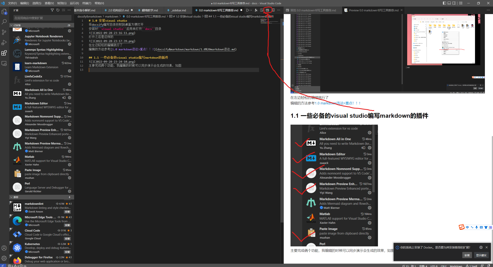

# 1.0 安装visual studio
将docsify编写目录投射到桌面方便打开  
安装好``visual studio``后用来打开``docs``目录  
    
打开之后是这样的  
  
在左边轻松的编辑就行了  
编辑的方法参考[1.0 markdown语法>重点！！!](docsify&markdown/markdown/1.0%20markdown语法.md)  

## 1.1 一些必备的visual studio编写markdown的插件  
  
主要完成俩个功能，我编辑的时候可以同步演示会生成的效果，如图  
  
打开这个按钮就可以了  
``Paste Image``非常好用，它可以将您截图的图片一键插入，方法：
* 用``win + shift + s``截图之后
* 可以点击截图工具稍微修改之后再黏贴  
  
* 用``ctrl + shift + p``打开vs命令控制行，第一次需要下翻找到``Paste Image``或者``ctrl + alt + v``找到，后面直接``enter``就可以了非常方便  
  

