# 1.0 导入结构
``import->structures->ceramics->graphite.msi``  
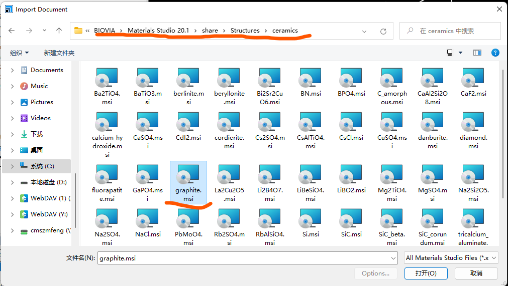   

# 2.0 制作
全选原子后用``make p1``先消除周期性确保删除一层不会全部删掉  
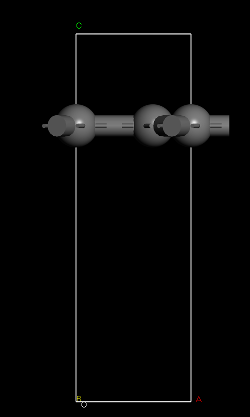  

## 2.1简单扩胞
开始：   
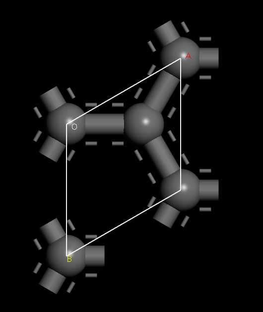  
2*2之后：   
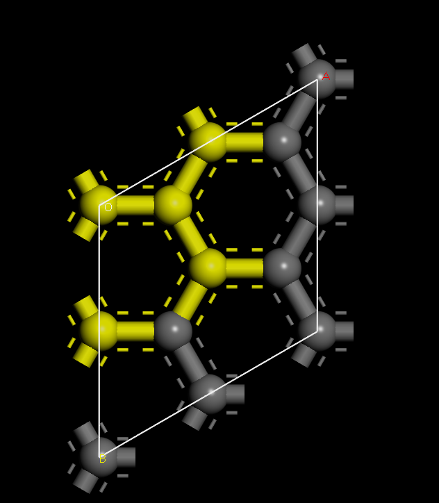  

## 2.2扩胞修剪
补充一下，在materials studio中：  
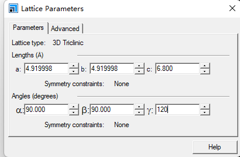  
``OA=a，OB=b，OC=c``  
``∠BOC=alpha，∠AOC=betta，∠AOB=gamma``  
当改变``∠gamma``为90度的时候，实际上``OB``边长度不变，``OA``边变化，向``OB``方向缩减30度  
边上的三个原子也硬拽过来但是``OA``长度也不变，这就导致一个问题  
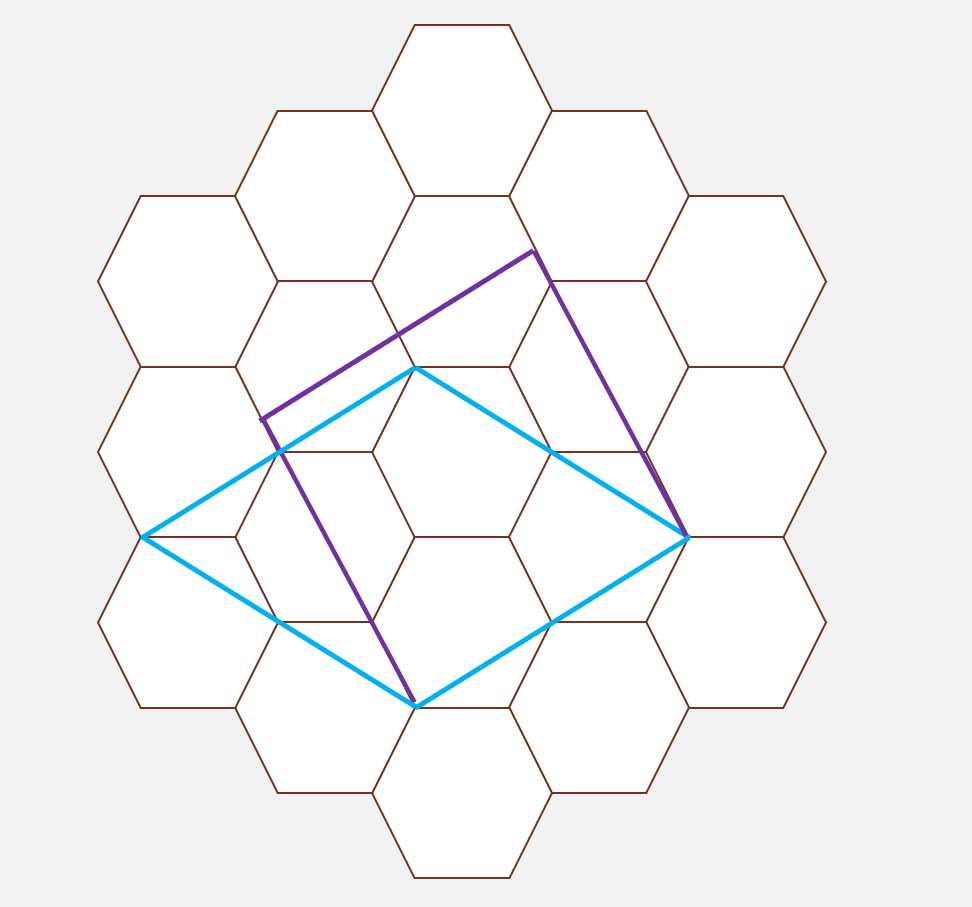  
即原来在下面的三个原子被抬高了，所以要按照比例裁剪一下，简单几何计算比例关系为  
$4.919998 \times \frac{\sqrt{3}}{2}=4.260843$  
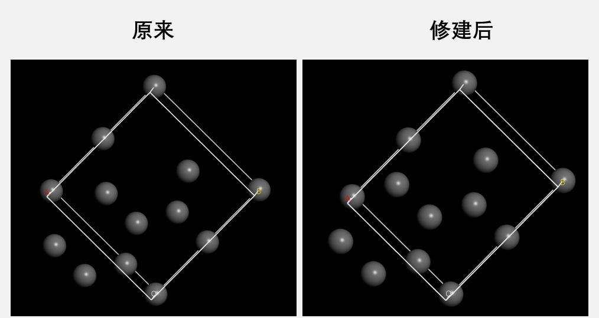  
其实差别还是很明显，这样原子位置数据就对了哈哈哈。  
扩胞之后也没有问题：  
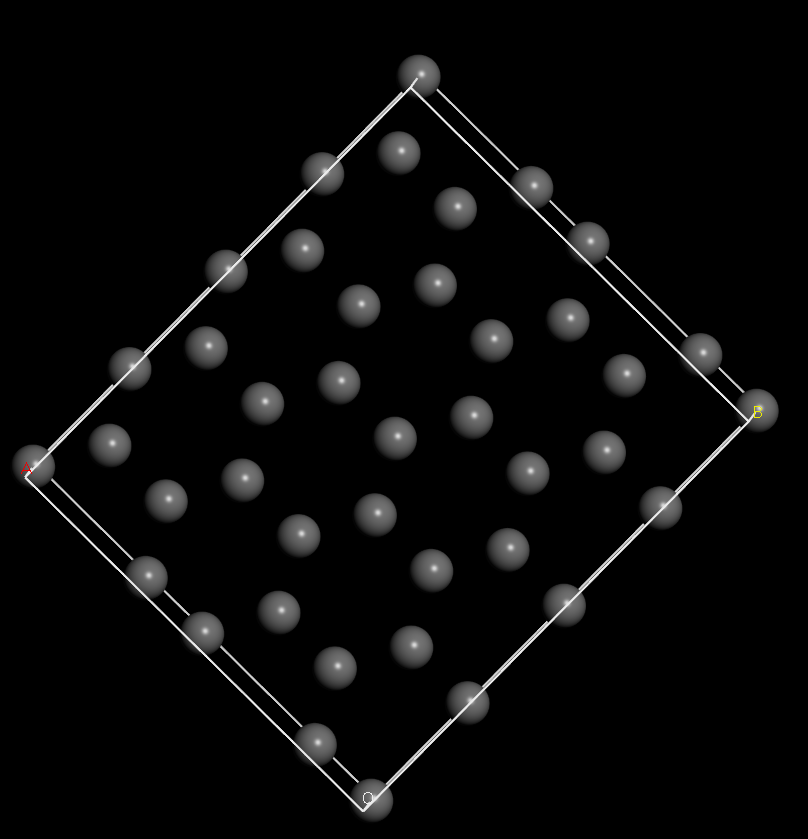  

## 2.3寻找更小周期性结构  
``find symmetry``命令之后发现其实石墨烯的周期性单胞特别小  
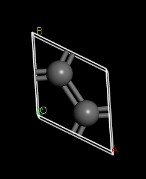  
由此引发思考其实我们的周期性矩形结构可以做的更小一点  
注意到其实刚刚的中间一半仍然可以做更小构型  
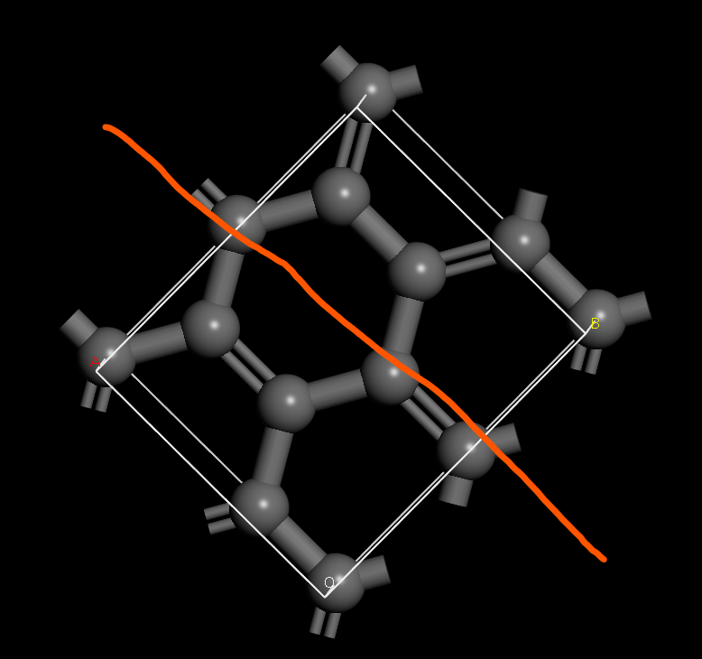  
``b``改为一半就好了  
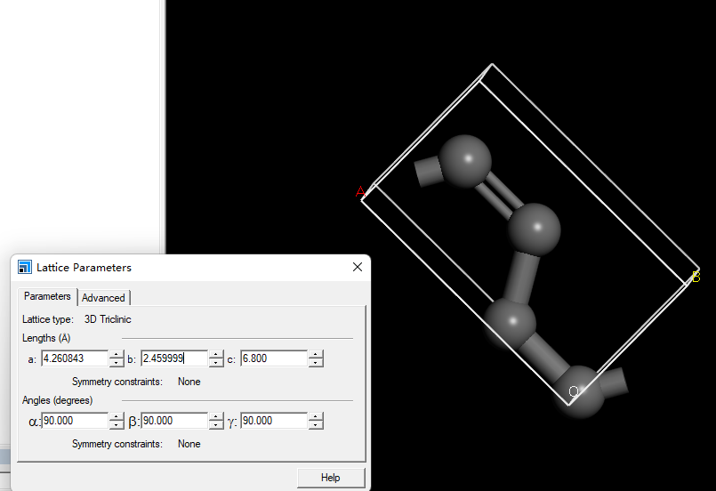  
可以正常扩胞，没有问题  
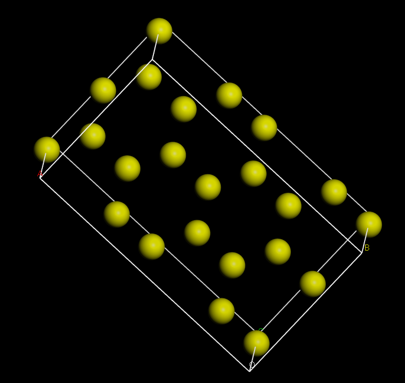  

# 3.0 总结
``MS``中直接在``lattice parameters``里面改变形状和位置会引起原理原子相对位置的改变，  
有的地方不变，有的地方变了，要把变了的地方记得用系数修正，不然与真实物理失准！！！  

