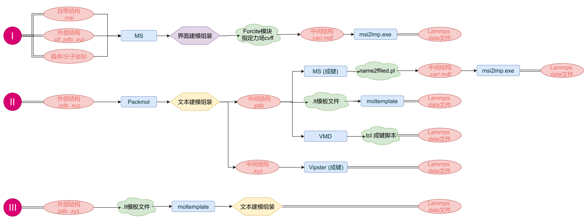
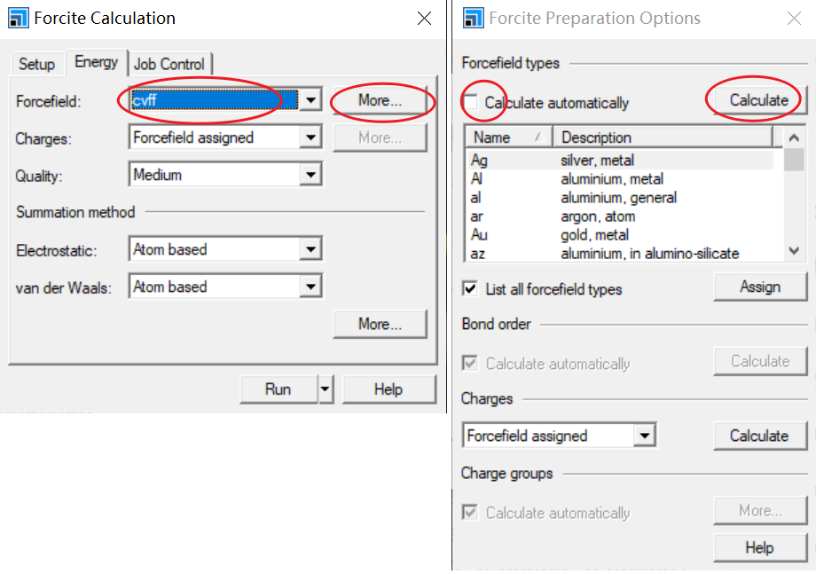
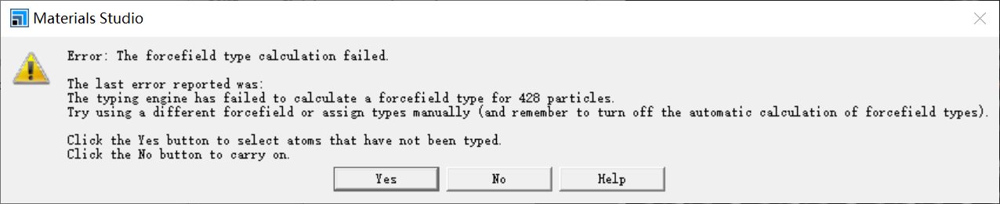

20210211-Lammps data文件建模格式转换进阶：I

### 在`Lammps`计算中，复杂模型的组装和格式的转换是一个难点问题，今天给大家介绍一些常用的建模路线图。

&emsp;&emsp;在模型组装中常用的软件为`MS`和`Packmol`，其中`MS`的优点是具有强大的原子操控能力，能直观的对模型进行增减删移等操作，其缺点是组装能力较弱，对非晶结构或溶液结构构建较弱。`Packmol`软件则专注于完成不同原子结构的组装任务，两者结合起来使用将能完成绝大多数复杂模型的构建。

&emsp;&emsp;但是，完成复杂模型的构建后，还存在一个大的障碍，就是如何将模型正确导出为`Lammps`需要的`Data`文件格式。目前大家也都是各有各的神通妙计，今天在这里就介绍我常用的几种模型搭建和转化策略。

&emsp;&emsp;下图为三种常用的模型构建策略路线图`I`、`II`、`III`。

&emsp;&emsp;路线`I`为先在`MS`中完成模型的构建和组装，然后导出为`.car`文件格式，导出时会生成`.car`和`.mdf`两个同名文件，然后利用`msi2lmp.exe`小程序来完成格式的转换。其中的难点和易错点为利用`Forcite`模块进行力场的指定，这个地方经常会有学员没有理解产生疑惑。实际上大家需要理解`Forcite`模块进行力场的指定的真正目的：在`MS中`通过`ForcefiledType`力场类型这一标记来完成对不同原子类型的区分。

&emsp;&emsp;如下图所示，将每个原子`ForcefiledType`力场类型作为标签显示，可见碳链中间的原子力场类型标记为`C2`，碳链中间的原子力场类型标记为`C3`。

&emsp;&emsp;但是使用`cvff`力场自动分配为力场类型的时候会经常出现力场类型计算失败的报错，这是因为目前自带`cvff`力场内部力场参数类型有限，当结构中出现力场文件中未有的元素力场类型就无法完成所有原子的力场分配，但是能识别的原子的力场类型还是能完成分配。这个时候可以点弹出对话框的`Yes`,手动完成剩余原子类型的力场分配。但是通常不大推荐这种方法，因为不方便且很容易出错。

&emsp;&emsp;上述力场分配完成后，尽量再肉眼检查一遍，确认每种不同原子类型和每个原子都正确分配到了对应力场类型，然后将结构文件导出为`.car`文件格式，然后利用`msi2lmp.exe`小程序来完成格式的转换，即可生成需要的`data`文件。

&emsp;&emsp;`data`文件生成后，可以用文本编辑器将其打开检查：
- 原子类型、键类型、角类型是不是与预期一致，是不是有不合理的键出现。如若出现，需要回到MS中将该不合理键手动删除。
- 原子质量是不是不为0。如若为0，是因为cvff力场文件参数不全，手动将对应原子质量修正即可。如将1类原子S 由1 0.000 手动修正为 1 32.000。
- 转换是自动生成力场参数是不是符合需求。在95%的情况下转换时自动生成的力场参数都是不需要的，可以直接删除。后期在in文件中写入正确的力场参数即可。

