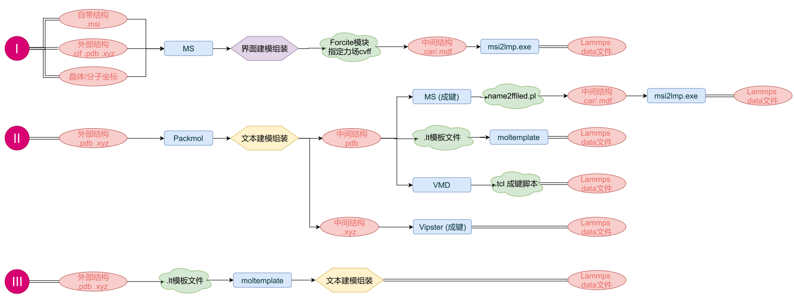
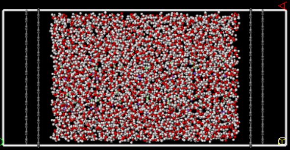
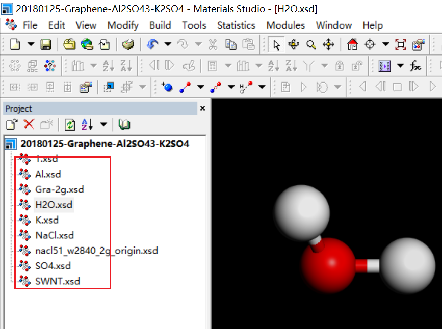
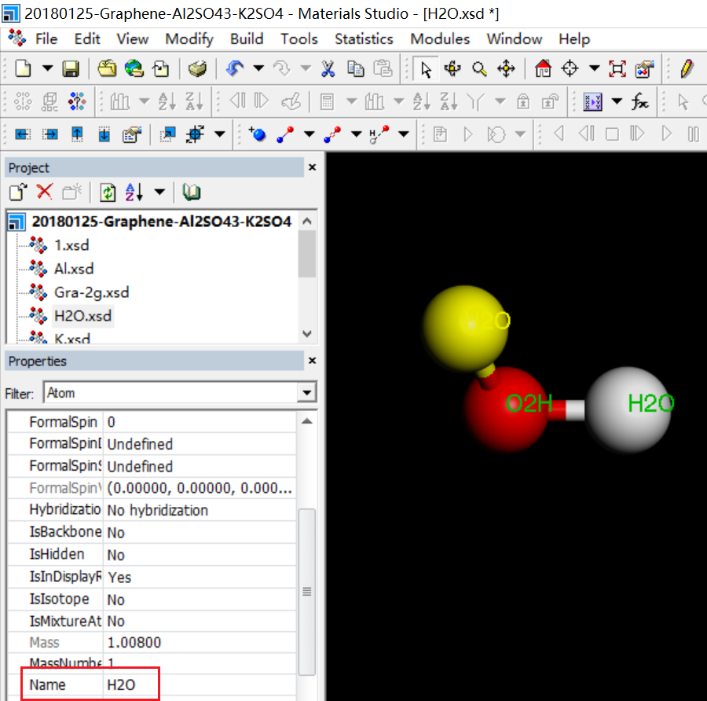
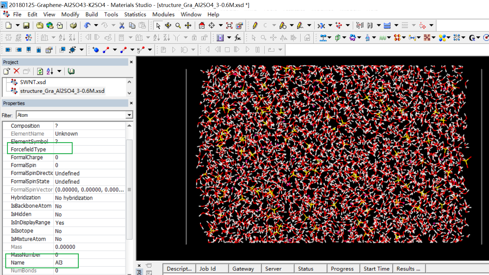
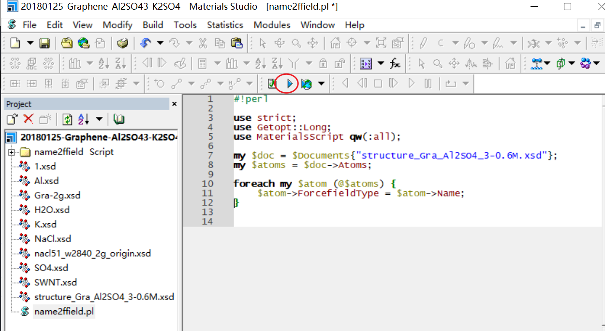
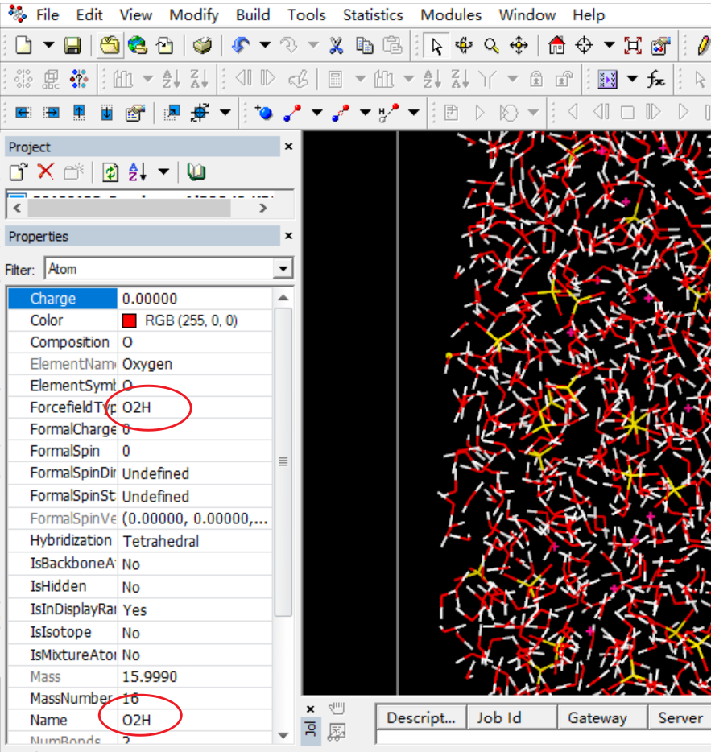
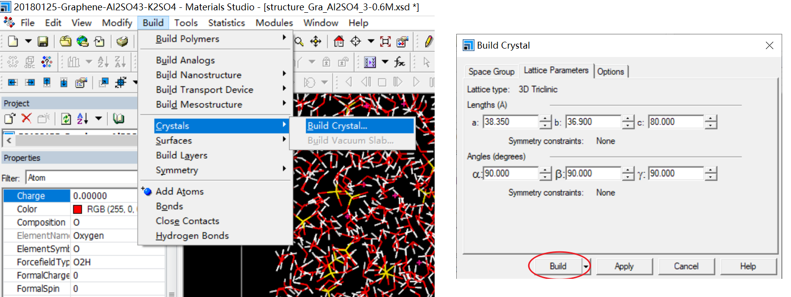
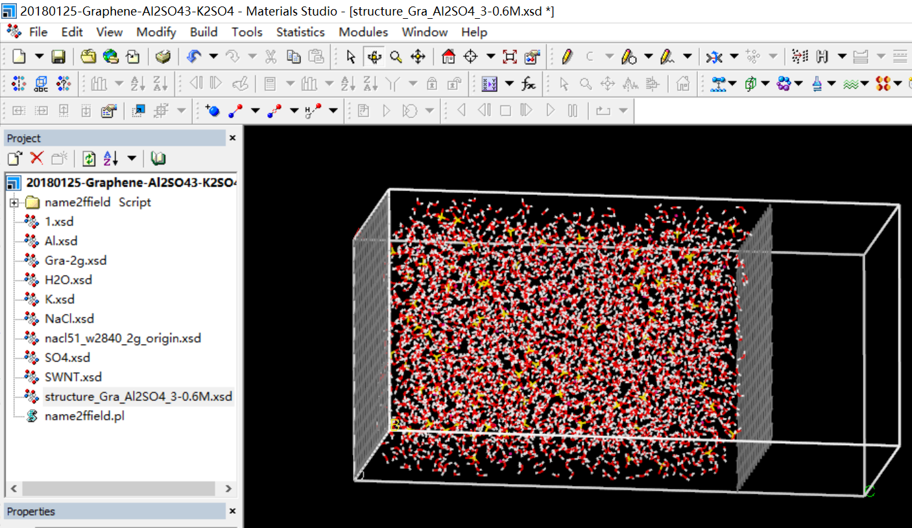
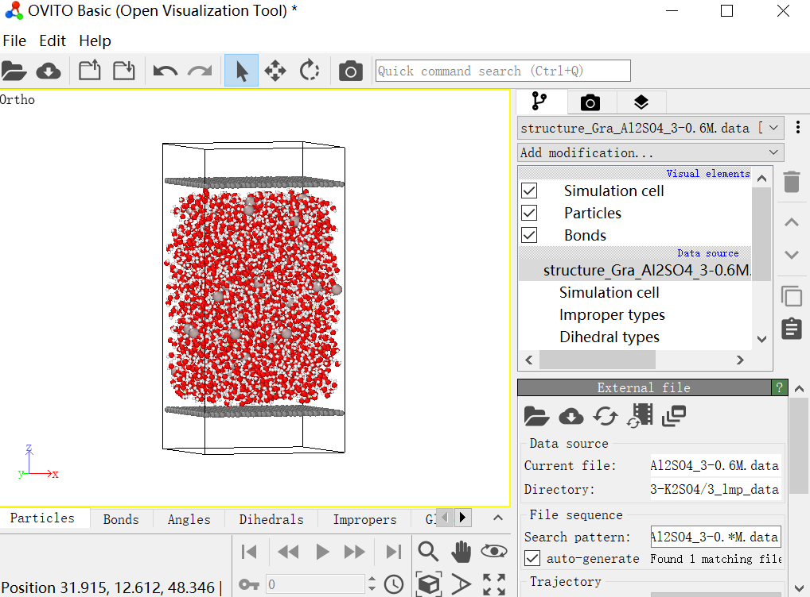

20210211-Lammps data文件建模格式转换进阶：II

### 在`Lammps`计算中，复杂模型的组装和格式的转换是一个难点问题，今天给大家介绍一些常用的建模路线图。

&emsp;&emsp;下图为三种常用的模型构建策略路线图`I`、`II`、`III`。



&emsp;&emsp;通常情况下路线`I`能完成许多基本的模型构建和导出，当遇到一些较复杂的模型需要组装时就会显得力不从心了。如下图这种，多组分固液模型组装。



&emsp;&emsp;此时，我们需要利用到组装工具软件`Packmol`，按照路线`II`完成组装和转化。

1. 在`MS`中构建好所需要的所有组分结构，导出为`.pdb`文件。



需要注意的是，导出前需要手动设置每个原子的`Name`，相同原子类型的设置为相同`Name`，不同原子类型需要设置为不同`Name`，此处设置为该路线中的关键步骤。



2. 编写用于`Packmol`组装的`in`文件，利用`packmol.exe`可执行程序完成组装,得到组装完成结构文件`structure_Gra_Al2SO4_3-0.6M.pdb`。

```py
# 距离容差, 不同分子中原子间的最小距离2A
tolerance 2.0

# 输入输出文件的格式
filetype pdb

# 输出文件的名字
output structure_Gra_Al2SO4_3-0.6M.pdb

#
structure Gra.pdb
  number 1
  center
  fixed 19.0179 18.45 30.01 0. 0. 0.
end structure

#
structure H2O.pdb
  number 2840
  inside box 1.0 1.0 1.0 37.5 37.0 59.0
end structure

#
structure Al.pdb
  number 60
  inside box 1.0 1.0 1.0 37.5 37.0 59.0
end structure

#
structure SO4.pdb
  number 90
  inside box 1.0 1.0 1.0 37.5 37.0 59.0
end structure
```

3. 将组装完成结构文件`structure_Gra_Al2SO4_3-0.6M.pdb`重新拖回到`MS`中。任意选中一个原子，可以发现原子属性中`Name`栏为预设原子`Name`，而`ForcefiledType`力场类型栏为空。



此时我们借助`name2ffield.pl`脚本将结构中所有原子`Name`属性复制到`ForcefiledType`属性。




`name2ffield.pl`文件内容如下

```perl
#!perl

use strict;
use Getopt::Long;
use MaterialsScript qw(:all);

my $doc = $Documents{"structure_Gra_Al2SO4_3-0.6M.xsd"};
my $atoms = $doc->Atoms;

foreach my $atom (@$atoms) {
    $atom->ForcefieldType = $atom->Name;
}
```

`name2ffield.pl`脚本执行完，可以随意选择其中几个原子检查`ForcefiledType`力场类型设置是否正确完成。



4. `ForcefiledType`力场类型设置完成后，在MS中添加晶格。



晶格添加完成后模型



5. 导出为为`.car`文件格式，然后利用`msi2lmp.exe`小程序来完成格式的转换，即可生成需要的`data`文件`structure_Gra_Al2SO4_3-0.6M.data`。重复路线`I`中对应检查。使用`Ovito`软件查看`data`文件，可得如下所示结构。



附件：本案例中对应结构文件