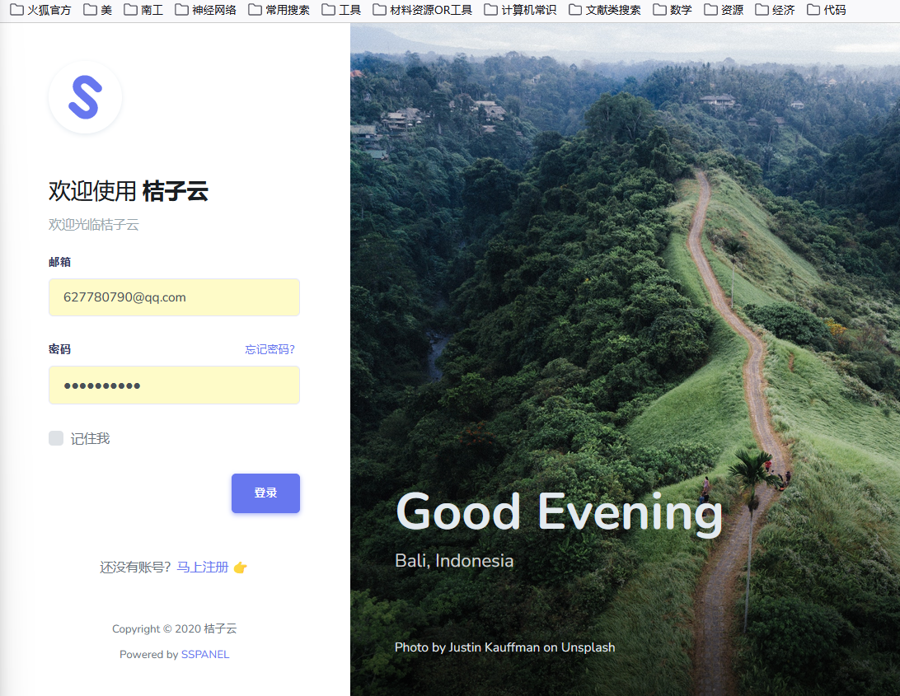
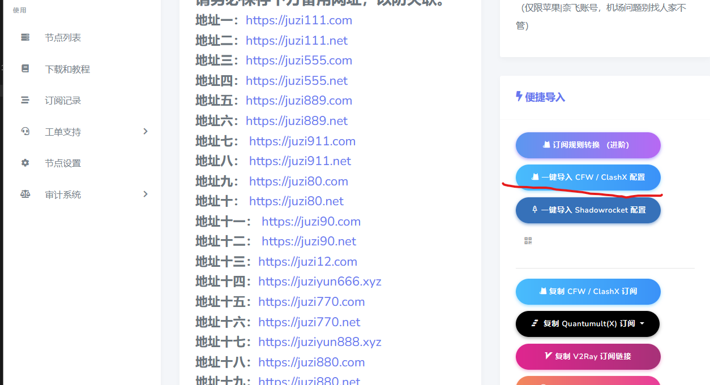
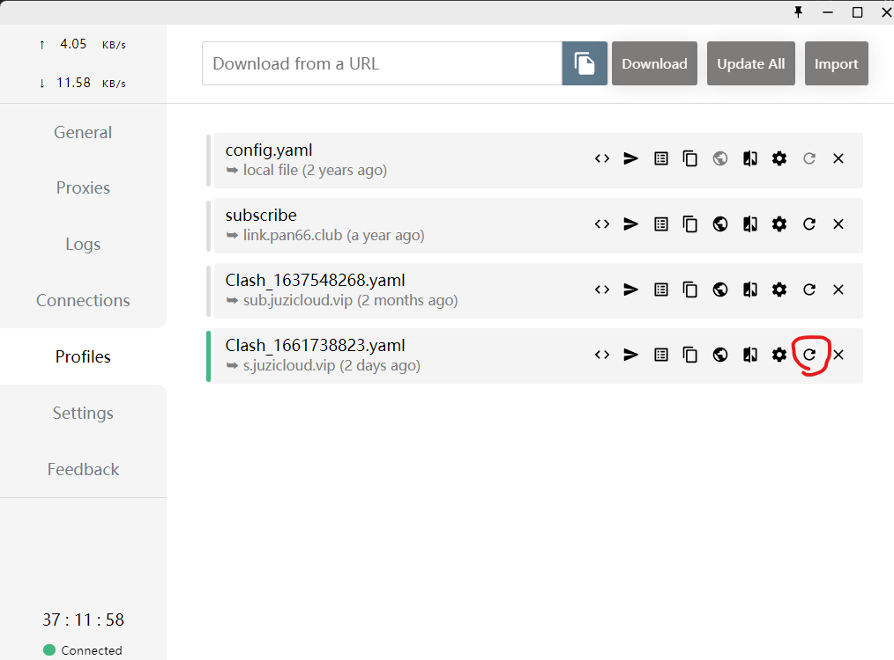
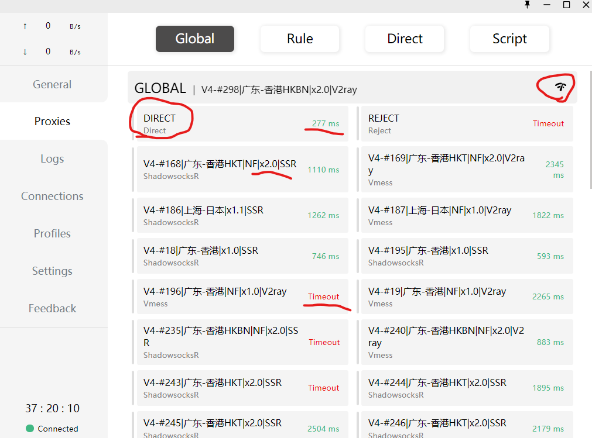
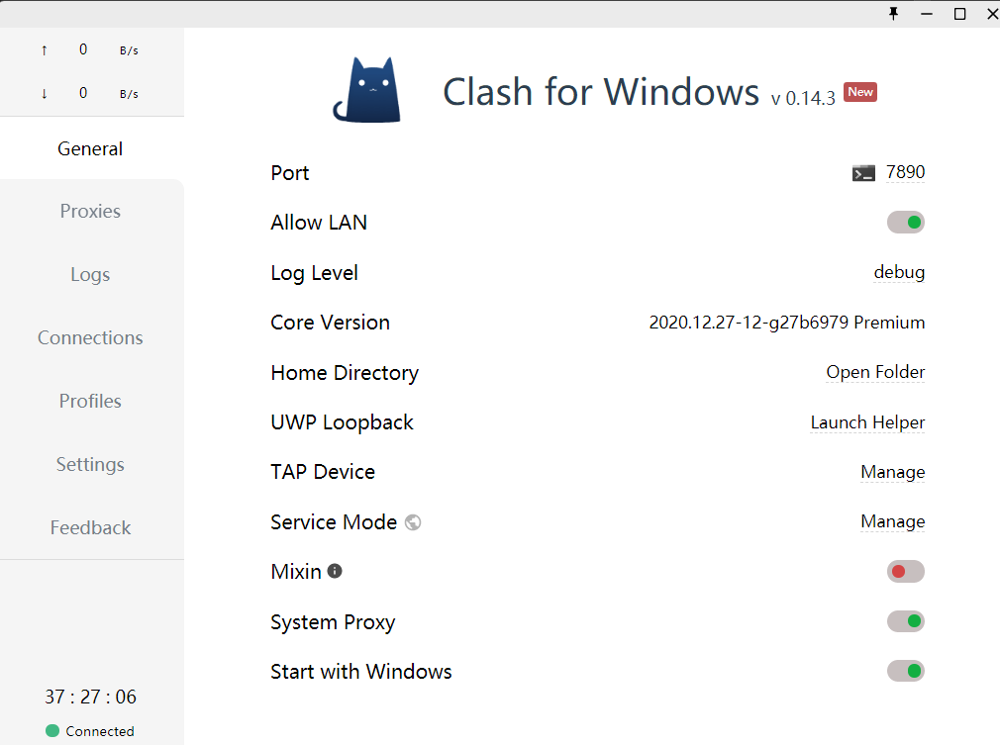

#  0.0 翻墙重要意义
翻墙对于科研非常重要，尤其是对于搞计算的同学经常要上*GIthub*，另外有的时候*Njtech*不稳定各种网站会被污染这个时候翻墙提供了直接访问的另一种渠道，*Google*和*Youtube* 也是重要的搜索信息渠道。  

# 1.0 翻墙原理和所需工具    

## 1.1 原理
我们都是生活在IPV4网络下，但是由于我国需要防止境外渗透把部分域名在DNS服务器上涂黑了，导致你无法进入  
但是仍然有部分服务器（主要在深圳、海南）可以与香港的服务器直连  
而香港的服务器是没有域名污染的就可以快乐的访问了  

我们要翻墙实际上就是要一个 **能够直连外网服务器的地址** **加一个网络环境配置工具** 
黑话叫 **机场**  和   **梯子**  

## 1.2 梯子
主流的梯子很多SSR V2RAY CLASH等等，我最近喜欢用的是clash

在我们服务器上我放好了安装包
\\10.10.136.81\smb_public\Software\VPN  

一步步安装好就行

## 1.3 机场
我目前使用的机场是[桔子云](https://juzi111.com/auth/login)  
有的时候换域名多敲juzi111，juzi222试试  
  

注册登录就好

## 1.4 机场资源哪里找  
多看看Youtube一些机场贩子博主一般喜欢倒腾这些东西赚点广告费，比如我一般用的是冰河圈子  
  
手机下载安装Telegram扫码加群  

# 2.0 食用方法  

## 2.1 导入机场到梯子  
进入网站，自己先购买几个月套餐，实际上大家可以白嫖我的（虽然说它同时只能登录3个设备经过我的实际测试多少个都没有问题，账号密码就在安装包目录下）  
  
一件导入就完事  

## 2.2 勤按刷新，寻找服务器地址  
由于``2.1``导入的是http地址而服务器真实ip地址会时常变换，需要定期（十几天左右，或者可以一直不刷新等到``2.3``子服务器无法刷新再刷新也可以）刷新http不断获取最新的服务器   
  
如果遇到特殊情况，http失效了，这个方法不能刷新了，重新登录[桔子云](https://juzi111.com/auth/login)用``2.1``再来一遍就行  

## 2.3 遍历子服务器的延迟  
我们在``2.2``获得的只是可以与翻墙通讯的服务器的服务器的地址，我叫它**根服务器**；可以与翻墙通讯的服务器，我叫它**子服务器**  
  
类似wifi的图标就是刷新子服务器并且查看延迟,``direct``是直接链接意思是不走服务器正常上网，绿色的是延迟越低越好500ms左右就可以了，经验上来说x2.0比x1.0的网络效果更好。``timeout``是服务器宕机了不能连接的意思 

然后点击你想要的子服务器，选中

## 2.4 配置网络环境覆盖本机

我们以上的操作只是建立了一个本机与外网的网络通讯，但是这种上网环境我们需要应用到本地计算机，参考这个配置就好  
  
``system proxy``可以看做开关，打开就启用VPN环境，关闭就正常和以前一样上内网  
**一定要注意，每次使用完后记得关闭，否则下次关机开机无法正常上内网**  
**但是不用紧张**  
**遇到这种情况99%就是clash忘记关了，打开clash吧``system proxy``关了就行**  

